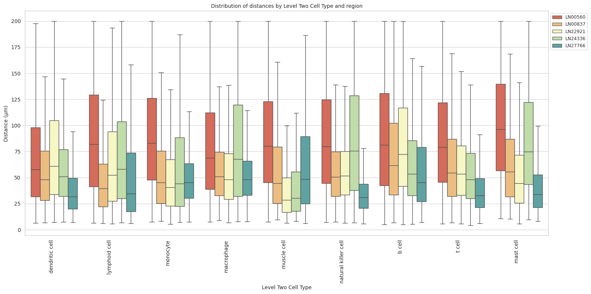

# Distance Analysis: lymphnode-codex-yale


<!-- WARNING: THIS FILE WAS AUTOGENERATED! DO NOT EDIT! -->

``` python
import numpy as np
import pandas as pd
import os
import json
import requests
import shutil
import matplotlib.pyplot as plt
import seaborn as sns
from sklearn.preprocessing import normalize
import plotly.express as px

from _cde_compute_edges_from_nodes import *

pd.set_option('display.max_columns', None)
pd.set_option('display.max_rows', None)

# suppress warnings
import warnings
warnings.filterwarnings("ignore")
```

``` python
basepath = "/u/yashjain/hra-cell-distance-analysis/data"
dataset_dir = "lymphnode-codex-yale"
data_filedir = os.path.join("data-processed-nodes-with-harmonized-cell-types", dataset_dir)
output_edge_dir = os.path.join("data-processed-edges", dataset_dir)
figures_output_dir = "generated-figures"
```

``` python
# Function to load your data
def load_data(path, edges=False):
    if edges:
        column_names = ['cell_id', 'x1', 'y1', 'z1', 'x2', 'y2', 'z2']
        data = pd.read_csv(path, header=None, names=column_names)
    else:
        data = pd.read_csv(path)
    return data
```

``` python
# Function to read all files ending with "-nodes.csv" in the `data_filedir` directory into a single DataFrame. 
# Another additional column `Dataset` is added to identify the dataset name which comes from the filename before the `-nodes.csv` suffix.

# Additionally, function reads all files ending with "-edges.csv" in the `output_edge_dir` directory into a single DataFrame. 
# Three additional columns are added "Dataset", "Anchor Cell Type", and "Anchor Cell Type Level" to identify the dataset name, anchor cell type, and anchor cell type level respectively which come from the filename before the `.csv` suffix.
# The three additional columns are created by splitting the filename on the `-` character, and extracting the relevant parts.
# On splitting, the first part is the dataset name, second part is the anchor cell type level, and third part is the anchor cell type, and last part is the `edges` suffix.
# When reading files, check if the file has the correct format (i.e., ends with `-edges.csv`).

# Additionally, the function merges the edges DataFrame with the nodes DataFrame to get the cell type information for the anchor cells.
# This is done by reading the corresponding nodes file from the `data_filedir` directory for each edges file, and merging it with the edges DataFrame on the `cell_id` column.
# The merged DataFrame contains the edges with additional columns for the cell type information.

# The function returns three DataFrames:
# 1. `merged_nodes`: DataFrame containing all nodes with an additional column `Dataset`.
# 2. `merged_edges`: DataFrame containing all edges with additional columns `Dataset`, `Anchor Cell Type`, and `Anchor Cell Type Level`.
# 3. `merged_nodes_for_all_edges`: DataFrame containing all edges with additional columns `Dataset`, `Anchor Cell Type`, `Anchor Cell Type Level`, and the cell type information for cells.
def read_all_edge_datasets(basepath, data_filedir, output_edge_dir):
    all_nodes_files = []
    all_edges_files = []
    all_nodes_edges_files = []
    for file in os.listdir(os.path.join(basepath, output_edge_dir)):
        if file.endswith("-edges.csv"):
            file_path = os.path.join(basepath, output_edge_dir, file)
            dataset_name, anchor_cell_type_level, anchor_cell_type = file.replace("-edges.csv", "").split('-')
            edges_df = load_data(file_path, edges=False)
            edges_df['Dataset'] = dataset_name
            edges_df['Anchor Cell Type'] = anchor_cell_type
            edges_df['Anchor Cell Type Level'] = anchor_cell_type_level
            edges_df.rename(columns={"distance": "Distance"}, inplace=True) # Rename column "distance" to "Distance".
            all_edges_files.append(edges_df)

            # Read the corresponding nodes file from data_filedir to get the cell type information
            nodes_file_path = os.path.join(basepath, data_filedir, f"{dataset_name}-nodes.csv")
            nodes_df = load_data(nodes_file_path)
            nodes_df['Dataset'] = dataset_name
            all_nodes_files.append(nodes_df)

            # Add a new 'cell_id' column to nodes_df
            nodes_df['cell_id'] = range(len(nodes_df))
            # Set 'cell_id' column as index for nodes_df
            nodes_df.set_index('cell_id', inplace=True)
            # Merge edges_df with nodes_df to get the cell type information for the anchor cells
            edges_nodes_df = pd.merge(edges_df, nodes_df[['Level Three Cell Type', 'Level Two Cell Type', 'Level One Cell Type']], how='left', left_on='cell_id', right_index=True)
            all_nodes_edges_files.append(edges_nodes_df)

    
    merged_edges = pd.concat(all_edges_files, ignore_index=True)
    merged_nodes = pd.concat(all_nodes_files, ignore_index=True)
    merged_nodes_for_all_edges = pd.concat(all_nodes_edges_files, ignore_index=True) 

    return merged_nodes, merged_edges, merged_nodes_for_all_edges
```

``` python
def create_directory(directory):
    if not os.path.exists(directory):
        os.makedirs(directory)
        print(f"Directory '{directory}' created successfully.")
    else:
        print(f"Directory '{directory}' already exists.")
```

## Get initial statistics and identify endothelial cell categories for dataset.

``` python
df_all_nodes, df_all_edges, df_all_edges_with_cell_types = read_all_edge_datasets(basepath, data_filedir, output_edge_dir)
```

``` python
df_all_nodes.head(5)
```

<div>
<style scoped>
    .dataframe tbody tr th:only-of-type {
        vertical-align: middle;
    }
&#10;    .dataframe tbody tr th {
        vertical-align: top;
    }
&#10;    .dataframe thead th {
        text-align: right;
    }
</style>

<table class="dataframe" data-quarto-postprocess="true" data-border="1">
<thead>
<tr style="text-align: right;">
<th data-quarto-table-cell-role="th"></th>
<th data-quarto-table-cell-role="th">x</th>
<th data-quarto-table-cell-role="th">y</th>
<th data-quarto-table-cell-role="th">Original Cell Type</th>
<th data-quarto-table-cell-role="th">Level Three Cell Type</th>
<th data-quarto-table-cell-role="th">Level Three CL Label</th>
<th data-quarto-table-cell-role="th">Level Three CL ID</th>
<th data-quarto-table-cell-role="th">CL_Match/3</th>
<th data-quarto-table-cell-role="th">Level Two Cell Type</th>
<th data-quarto-table-cell-role="th">Level Two CL Label</th>
<th data-quarto-table-cell-role="th">Level Two CL ID</th>
<th data-quarto-table-cell-role="th">CL_Match/2</th>
<th data-quarto-table-cell-role="th">Level One Cell Type</th>
<th data-quarto-table-cell-role="th">Level One CL Label</th>
<th data-quarto-table-cell-role="th">Level One CL ID</th>
<th data-quarto-table-cell-role="th">CL_Match/1</th>
<th data-quarto-table-cell-role="th">Dataset</th>
</tr>
</thead>
<tbody>
<tr>
<td data-quarto-table-cell-role="th">0</td>
<td>26180.447514</td>
<td>8865.939227</td>
<td>FDC</td>
<td>dendritic cell:follicular</td>
<td>follicular dendritic cell</td>
<td>CL:0000442</td>
<td>skos:exactMatch</td>
<td>dendritic cell</td>
<td>dendritic cell</td>
<td>CL:0000451</td>
<td>skos:exactMatch</td>
<td>mesenchymal cell</td>
<td>mesenchymal cell</td>
<td>CL:0008019</td>
<td>skos:exactMatch</td>
<td>LN00560</td>
</tr>
<tr>
<td data-quarto-table-cell-role="th">1</td>
<td>15214.596774</td>
<td>11441.217742</td>
<td>FDC</td>
<td>dendritic cell:follicular</td>
<td>follicular dendritic cell</td>
<td>CL:0000442</td>
<td>skos:exactMatch</td>
<td>dendritic cell</td>
<td>dendritic cell</td>
<td>CL:0000451</td>
<td>skos:exactMatch</td>
<td>mesenchymal cell</td>
<td>mesenchymal cell</td>
<td>CL:0008019</td>
<td>skos:exactMatch</td>
<td>LN00560</td>
</tr>
<tr>
<td data-quarto-table-cell-role="th">2</td>
<td>7498.846154</td>
<td>12306.583333</td>
<td>FDC</td>
<td>dendritic cell:follicular</td>
<td>follicular dendritic cell</td>
<td>CL:0000442</td>
<td>skos:exactMatch</td>
<td>dendritic cell</td>
<td>dendritic cell</td>
<td>CL:0000451</td>
<td>skos:exactMatch</td>
<td>mesenchymal cell</td>
<td>mesenchymal cell</td>
<td>CL:0008019</td>
<td>skos:exactMatch</td>
<td>LN00560</td>
</tr>
<tr>
<td data-quarto-table-cell-role="th">3</td>
<td>26618.031142</td>
<td>18349.024221</td>
<td>FDC</td>
<td>dendritic cell:follicular</td>
<td>follicular dendritic cell</td>
<td>CL:0000442</td>
<td>skos:exactMatch</td>
<td>dendritic cell</td>
<td>dendritic cell</td>
<td>CL:0000451</td>
<td>skos:exactMatch</td>
<td>mesenchymal cell</td>
<td>mesenchymal cell</td>
<td>CL:0008019</td>
<td>skos:exactMatch</td>
<td>LN00560</td>
</tr>
<tr>
<td data-quarto-table-cell-role="th">4</td>
<td>8325.500000</td>
<td>12150.222222</td>
<td>FDC</td>
<td>dendritic cell:follicular</td>
<td>follicular dendritic cell</td>
<td>CL:0000442</td>
<td>skos:exactMatch</td>
<td>dendritic cell</td>
<td>dendritic cell</td>
<td>CL:0000451</td>
<td>skos:exactMatch</td>
<td>mesenchymal cell</td>
<td>mesenchymal cell</td>
<td>CL:0008019</td>
<td>skos:exactMatch</td>
<td>LN00560</td>
</tr>
</tbody>
</table>

</div>

``` python
# Print the total number of unique cell types per dataset. Compute separately for each cell type column (Level One Cell Type, Level Two Cell Type, Level Three Cell Type, Original Cell Type).
print("Total number of unique cell types per cell type annnotation level:")
unique_cell_types = {
    'Original Cell Type': df_all_nodes['Original Cell Type'].nunique(),
    'Level Three Cell Type': df_all_nodes['Level Three Cell Type'].nunique(),
    'Level Two Cell Type': df_all_nodes['Level Two Cell Type'].nunique(),
    'Level One Cell Type': df_all_nodes['Level One Cell Type'].nunique()
}
for cell_type, count in unique_cell_types.items():
    print(f"{cell_type}: {count}")
```

    Total number of unique cell types per cell type annnotation level:
    Original Cell Type: 34
    Level Three Cell Type: 29
    Level Two Cell Type: 10
    Level One Cell Type: 3

``` python
# Save the unique cell types containing "endothelial" in name per cell type column (Level One Cell Type, Level Two Cell Type, Level Three Cell Type, Original Cell Type) to a dictionary where the key is the level and the value is a list of unique cell types.
endothelial_cell_types = {
    'Original Cell Type': df_all_nodes[df_all_nodes['Original Cell Type'].str.contains("endothelial", case=False, na=False)]['Original Cell Type'].unique().tolist(),
    'Level Three Cell Type': df_all_nodes[df_all_nodes['Level Three Cell Type'].str.contains("endothelial", case=False, na=False)]['Level Three Cell Type'].unique().tolist(),
    'Level Two Cell Type': df_all_nodes[df_all_nodes['Level Two Cell Type'].str.contains("endothelial", case=False, na=False)]['Level Two Cell Type'].unique().tolist(),
    'Level One Cell Type': df_all_nodes[df_all_nodes['Level One Cell Type'].str.contains("endothelial", case=False, na=False)]['Level One Cell Type'].unique().tolist()
}

print("\nEndothelial cell types per cell type annotation level:")
for level, cell_types in endothelial_cell_types.items():
    print(f"\n{level}:")
    for cell in cell_types:
        print(f"  - {cell}")
```


    Endothelial cell types per cell type annotation level:

    Original Cell Type:
      - Endothelial

    Level Three Cell Type:
      - endothelial cell

    Level Two Cell Type:
      - endothelial cell

    Level One Cell Type:
      - endothelial cell

``` python
type_field_list = ["Level Three Cell Type", "Level Two Cell Type", "Level One Cell Type"] # Skipping Original Cell Type as it is not a hierarchical level.

# Define the anchor cell type (type of endothelial cell) for each level in type_field_list based on available categories in the previous cell. The distance analysis at all three levels will be limited to the specified anchor cell type.
anchor_cell_type_dict = {
    'Level Three Cell Type': 'endothelial cell',
    'Level Two Cell Type': 'endothelial cell',
    'Level One Cell Type': 'endothelial cell'
}
```

## Process datasets to add region information to Nodes files.

``` python
df_all_nodes.head()
```

<div>
<style scoped>
    .dataframe tbody tr th:only-of-type {
        vertical-align: middle;
    }
&#10;    .dataframe tbody tr th {
        vertical-align: top;
    }
&#10;    .dataframe thead th {
        text-align: right;
    }
</style>

<table class="dataframe" data-quarto-postprocess="true" data-border="1">
<thead>
<tr style="text-align: right;">
<th data-quarto-table-cell-role="th"></th>
<th data-quarto-table-cell-role="th">x</th>
<th data-quarto-table-cell-role="th">y</th>
<th data-quarto-table-cell-role="th">Original Cell Type</th>
<th data-quarto-table-cell-role="th">Level Three Cell Type</th>
<th data-quarto-table-cell-role="th">Level Three CL Label</th>
<th data-quarto-table-cell-role="th">Level Three CL ID</th>
<th data-quarto-table-cell-role="th">CL_Match/3</th>
<th data-quarto-table-cell-role="th">Level Two Cell Type</th>
<th data-quarto-table-cell-role="th">Level Two CL Label</th>
<th data-quarto-table-cell-role="th">Level Two CL ID</th>
<th data-quarto-table-cell-role="th">CL_Match/2</th>
<th data-quarto-table-cell-role="th">Level One Cell Type</th>
<th data-quarto-table-cell-role="th">Level One CL Label</th>
<th data-quarto-table-cell-role="th">Level One CL ID</th>
<th data-quarto-table-cell-role="th">CL_Match/1</th>
<th data-quarto-table-cell-role="th">Dataset</th>
</tr>
</thead>
<tbody>
<tr>
<td data-quarto-table-cell-role="th">0</td>
<td>26180.447514</td>
<td>8865.939227</td>
<td>FDC</td>
<td>dendritic cell:follicular</td>
<td>follicular dendritic cell</td>
<td>CL:0000442</td>
<td>skos:exactMatch</td>
<td>dendritic cell</td>
<td>dendritic cell</td>
<td>CL:0000451</td>
<td>skos:exactMatch</td>
<td>mesenchymal cell</td>
<td>mesenchymal cell</td>
<td>CL:0008019</td>
<td>skos:exactMatch</td>
<td>LN00560</td>
</tr>
<tr>
<td data-quarto-table-cell-role="th">1</td>
<td>15214.596774</td>
<td>11441.217742</td>
<td>FDC</td>
<td>dendritic cell:follicular</td>
<td>follicular dendritic cell</td>
<td>CL:0000442</td>
<td>skos:exactMatch</td>
<td>dendritic cell</td>
<td>dendritic cell</td>
<td>CL:0000451</td>
<td>skos:exactMatch</td>
<td>mesenchymal cell</td>
<td>mesenchymal cell</td>
<td>CL:0008019</td>
<td>skos:exactMatch</td>
<td>LN00560</td>
</tr>
<tr>
<td data-quarto-table-cell-role="th">2</td>
<td>7498.846154</td>
<td>12306.583333</td>
<td>FDC</td>
<td>dendritic cell:follicular</td>
<td>follicular dendritic cell</td>
<td>CL:0000442</td>
<td>skos:exactMatch</td>
<td>dendritic cell</td>
<td>dendritic cell</td>
<td>CL:0000451</td>
<td>skos:exactMatch</td>
<td>mesenchymal cell</td>
<td>mesenchymal cell</td>
<td>CL:0008019</td>
<td>skos:exactMatch</td>
<td>LN00560</td>
</tr>
<tr>
<td data-quarto-table-cell-role="th">3</td>
<td>26618.031142</td>
<td>18349.024221</td>
<td>FDC</td>
<td>dendritic cell:follicular</td>
<td>follicular dendritic cell</td>
<td>CL:0000442</td>
<td>skos:exactMatch</td>
<td>dendritic cell</td>
<td>dendritic cell</td>
<td>CL:0000451</td>
<td>skos:exactMatch</td>
<td>mesenchymal cell</td>
<td>mesenchymal cell</td>
<td>CL:0008019</td>
<td>skos:exactMatch</td>
<td>LN00560</td>
</tr>
<tr>
<td data-quarto-table-cell-role="th">4</td>
<td>8325.500000</td>
<td>12150.222222</td>
<td>FDC</td>
<td>dendritic cell:follicular</td>
<td>follicular dendritic cell</td>
<td>CL:0000442</td>
<td>skos:exactMatch</td>
<td>dendritic cell</td>
<td>dendritic cell</td>
<td>CL:0000451</td>
<td>skos:exactMatch</td>
<td>mesenchymal cell</td>
<td>mesenchymal cell</td>
<td>CL:0008019</td>
<td>skos:exactMatch</td>
<td>LN00560</td>
</tr>
</tbody>
</table>

</div>

``` python
# Iterate through the df_all_data dataframe to create new column "Unique Region" based on the "Dataset" column.
# The "Unique Region" column is created by mapping the region names based on the full dataset name.
df_all_nodes['Unique Region'] = df_all_nodes['Dataset']
# df_all_nodes['Unique Region'] = df_all_nodes['Dataset'].map(region_map)
# df_all_nodes['Unique Region'] = df_all_nodes['Dataset'].str.split('-').str[1].map(region_map)

# Check if the new columns are created correctly.
df_all_nodes[['Dataset', 'Unique Region']].head(5)
```

<div>
<style scoped>
    .dataframe tbody tr th:only-of-type {
        vertical-align: middle;
    }
&#10;    .dataframe tbody tr th {
        vertical-align: top;
    }
&#10;    .dataframe thead th {
        text-align: right;
    }
</style>

<table class="dataframe" data-quarto-postprocess="true" data-border="1">
<thead>
<tr style="text-align: right;">
<th data-quarto-table-cell-role="th"></th>
<th data-quarto-table-cell-role="th">Dataset</th>
<th data-quarto-table-cell-role="th">Unique Region</th>
</tr>
</thead>
<tbody>
<tr>
<td data-quarto-table-cell-role="th">0</td>
<td>LN00560</td>
<td>LN00560</td>
</tr>
<tr>
<td data-quarto-table-cell-role="th">1</td>
<td>LN00560</td>
<td>LN00560</td>
</tr>
<tr>
<td data-quarto-table-cell-role="th">2</td>
<td>LN00560</td>
<td>LN00560</td>
</tr>
<tr>
<td data-quarto-table-cell-role="th">3</td>
<td>LN00560</td>
<td>LN00560</td>
</tr>
<tr>
<td data-quarto-table-cell-role="th">4</td>
<td>LN00560</td>
<td>LN00560</td>
</tr>
</tbody>
</table>

</div>

``` python
# Print all unique regions in the data.
print("\nUnique Regions in the data:")
print(df_all_nodes['Unique Region'].unique())

# Print the total number of unique regions.
print(f"Total number of unique regions: {df_all_nodes['Unique Region'].nunique()}")

# Print number of unique datasets per unique region.
print("\nNumber of unique datasets per unique region:")
for region in df_all_nodes['Unique Region'].unique():
    num_datasets = df_all_nodes[df_all_nodes['Unique Region'] == region]['Dataset'].nunique()
    print(f"{region}: {num_datasets}")
```


    Unique Regions in the data:
    ['LN00560' 'LN00837' 'LN22921' 'LN24336' 'LN27766']
    Total number of unique regions: 5

    Number of unique datasets per unique region:
    LN00560: 1
    LN00837: 1
    LN22921: 1
    LN24336: 1
    LN27766: 1

## Process datasets to add region information to Edges files.

``` python
df_all_edges.head(5)
```

<div>
<style scoped>
    .dataframe tbody tr th:only-of-type {
        vertical-align: middle;
    }
&#10;    .dataframe tbody tr th {
        vertical-align: top;
    }
&#10;    .dataframe thead th {
        text-align: right;
    }
</style>

<table class="dataframe" data-quarto-postprocess="true" data-border="1">
<thead>
<tr style="text-align: right;">
<th data-quarto-table-cell-role="th"></th>
<th data-quarto-table-cell-role="th">cell_id</th>
<th data-quarto-table-cell-role="th">x1</th>
<th data-quarto-table-cell-role="th">y1</th>
<th data-quarto-table-cell-role="th">z1</th>
<th data-quarto-table-cell-role="th">x2</th>
<th data-quarto-table-cell-role="th">y2</th>
<th data-quarto-table-cell-role="th">z2</th>
<th data-quarto-table-cell-role="th">Distance</th>
<th data-quarto-table-cell-role="th">Dataset</th>
<th data-quarto-table-cell-role="th">Anchor Cell Type</th>
<th data-quarto-table-cell-role="th">Anchor Cell Type Level</th>
</tr>
</thead>
<tbody>
<tr>
<td data-quarto-table-cell-role="th">0</td>
<td>0</td>
<td>26180.447514</td>
<td>8865.939227</td>
<td>0</td>
<td>26183.569536</td>
<td>8838.370861</td>
<td>0</td>
<td>27.744582</td>
<td>LN00560</td>
<td>endothelial cell</td>
<td>Level Three Cell Type</td>
</tr>
<tr>
<td data-quarto-table-cell-role="th">1</td>
<td>1297</td>
<td>26171.400000</td>
<td>8972.626667</td>
<td>0</td>
<td>26264.875000</td>
<td>8904.781250</td>
<td>0</td>
<td>115.501412</td>
<td>LN00560</td>
<td>endothelial cell</td>
<td>Level Three Cell Type</td>
</tr>
<tr>
<td data-quarto-table-cell-role="th">2</td>
<td>3106</td>
<td>26140.166667</td>
<td>8974.675000</td>
<td>0</td>
<td>26054.031088</td>
<td>8889.103627</td>
<td>0</td>
<td>121.415805</td>
<td>LN00560</td>
<td>endothelial cell</td>
<td>Level Three Cell Type</td>
</tr>
<tr>
<td data-quarto-table-cell-role="th">3</td>
<td>3497</td>
<td>26051.509259</td>
<td>8961.282407</td>
<td>0</td>
<td>26054.031088</td>
<td>8889.103627</td>
<td>0</td>
<td>72.222822</td>
<td>LN00560</td>
<td>endothelial cell</td>
<td>Level Three Cell Type</td>
</tr>
<tr>
<td data-quarto-table-cell-role="th">4</td>
<td>49397</td>
<td>26015.800000</td>
<td>8832.882759</td>
<td>0</td>
<td>26054.031088</td>
<td>8889.103627</td>
<td>0</td>
<td>67.988250</td>
<td>LN00560</td>
<td>endothelial cell</td>
<td>Level Three Cell Type</td>
</tr>
</tbody>
</table>

</div>

``` python
# Process the edge data to create new columns "Unique Region" based on the "Dataset" column, similar to how it was done for the node data.
df_all_edges['Unique Region'] = df_all_edges['Dataset']
# df_all_edges['Unique Region'] = df_all_edges['Dataset'].map(region_map)


# Check if the new columns are created correctly.
df_all_edges[['Dataset', 'Unique Region']].head(5)
```

<div>
<style scoped>
    .dataframe tbody tr th:only-of-type {
        vertical-align: middle;
    }
&#10;    .dataframe tbody tr th {
        vertical-align: top;
    }
&#10;    .dataframe thead th {
        text-align: right;
    }
</style>

<table class="dataframe" data-quarto-postprocess="true" data-border="1">
<thead>
<tr style="text-align: right;">
<th data-quarto-table-cell-role="th"></th>
<th data-quarto-table-cell-role="th">Dataset</th>
<th data-quarto-table-cell-role="th">Unique Region</th>
</tr>
</thead>
<tbody>
<tr>
<td data-quarto-table-cell-role="th">0</td>
<td>LN00560</td>
<td>LN00560</td>
</tr>
<tr>
<td data-quarto-table-cell-role="th">1</td>
<td>LN00560</td>
<td>LN00560</td>
</tr>
<tr>
<td data-quarto-table-cell-role="th">2</td>
<td>LN00560</td>
<td>LN00560</td>
</tr>
<tr>
<td data-quarto-table-cell-role="th">3</td>
<td>LN00560</td>
<td>LN00560</td>
</tr>
<tr>
<td data-quarto-table-cell-role="th">4</td>
<td>LN00560</td>
<td>LN00560</td>
</tr>
</tbody>
</table>

</div>

``` python
# Print all unique regions in the data.
print("\nUnique Regions in the data:")
print(df_all_edges['Unique Region'].unique())

# Print the total number of unique regions.
print(f"Total number of unique regions: {df_all_edges['Unique Region'].nunique()}")

# Print number of unique datasets per unique region.
print("\nNumber of unique datasets per unique region:")
for region in df_all_edges['Unique Region'].unique():
    num_datasets = df_all_edges[df_all_edges['Unique Region'] == region]['Dataset'].nunique()
    print(f"{region}: {num_datasets}")
```


    Unique Regions in the data:
    ['LN00560' 'LN00837' 'LN22921' 'LN24336' 'LN27766']
    Total number of unique regions: 5

    Number of unique datasets per unique region:
    LN00560: 1
    LN00837: 1
    LN22921: 1
    LN24336: 1
    LN27766: 1

``` python
df_all_edges_with_cell_types['Unique Region'] = df_all_edges_with_cell_types['Dataset']
# df_all_edges_with_cell_types['Unique Region'] = df_all_edges_with_cell_types['Dataset'].map(region_map)

# Check if the new columns are created correctly.
df_all_edges_with_cell_types[['Dataset', 'Unique Region']].head(5)
```

<div>
<style scoped>
    .dataframe tbody tr th:only-of-type {
        vertical-align: middle;
    }
&#10;    .dataframe tbody tr th {
        vertical-align: top;
    }
&#10;    .dataframe thead th {
        text-align: right;
    }
</style>

<table class="dataframe" data-quarto-postprocess="true" data-border="1">
<thead>
<tr style="text-align: right;">
<th data-quarto-table-cell-role="th"></th>
<th data-quarto-table-cell-role="th">Dataset</th>
<th data-quarto-table-cell-role="th">Unique Region</th>
</tr>
</thead>
<tbody>
<tr>
<td data-quarto-table-cell-role="th">0</td>
<td>LN00560</td>
<td>LN00560</td>
</tr>
<tr>
<td data-quarto-table-cell-role="th">1</td>
<td>LN00560</td>
<td>LN00560</td>
</tr>
<tr>
<td data-quarto-table-cell-role="th">2</td>
<td>LN00560</td>
<td>LN00560</td>
</tr>
<tr>
<td data-quarto-table-cell-role="th">3</td>
<td>LN00560</td>
<td>LN00560</td>
</tr>
<tr>
<td data-quarto-table-cell-role="th">4</td>
<td>LN00560</td>
<td>LN00560</td>
</tr>
</tbody>
</table>

</div>

``` python
df_all_nodes.head(1)
```

<div>
<style scoped>
    .dataframe tbody tr th:only-of-type {
        vertical-align: middle;
    }
&#10;    .dataframe tbody tr th {
        vertical-align: top;
    }
&#10;    .dataframe thead th {
        text-align: right;
    }
</style>

<table class="dataframe" data-quarto-postprocess="true" data-border="1">
<thead>
<tr style="text-align: right;">
<th data-quarto-table-cell-role="th"></th>
<th data-quarto-table-cell-role="th">x</th>
<th data-quarto-table-cell-role="th">y</th>
<th data-quarto-table-cell-role="th">Original Cell Type</th>
<th data-quarto-table-cell-role="th">Level Three Cell Type</th>
<th data-quarto-table-cell-role="th">Level Three CL Label</th>
<th data-quarto-table-cell-role="th">Level Three CL ID</th>
<th data-quarto-table-cell-role="th">CL_Match/3</th>
<th data-quarto-table-cell-role="th">Level Two Cell Type</th>
<th data-quarto-table-cell-role="th">Level Two CL Label</th>
<th data-quarto-table-cell-role="th">Level Two CL ID</th>
<th data-quarto-table-cell-role="th">CL_Match/2</th>
<th data-quarto-table-cell-role="th">Level One Cell Type</th>
<th data-quarto-table-cell-role="th">Level One CL Label</th>
<th data-quarto-table-cell-role="th">Level One CL ID</th>
<th data-quarto-table-cell-role="th">CL_Match/1</th>
<th data-quarto-table-cell-role="th">Dataset</th>
<th data-quarto-table-cell-role="th">Unique Region</th>
</tr>
</thead>
<tbody>
<tr>
<td data-quarto-table-cell-role="th">0</td>
<td>26180.447514</td>
<td>8865.939227</td>
<td>FDC</td>
<td>dendritic cell:follicular</td>
<td>follicular dendritic cell</td>
<td>CL:0000442</td>
<td>skos:exactMatch</td>
<td>dendritic cell</td>
<td>dendritic cell</td>
<td>CL:0000451</td>
<td>skos:exactMatch</td>
<td>mesenchymal cell</td>
<td>mesenchymal cell</td>
<td>CL:0008019</td>
<td>skos:exactMatch</td>
<td>LN00560</td>
<td>LN00560</td>
</tr>
</tbody>
</table>

</div>

``` python
df_all_edges.head(1)
```

<div>
<style scoped>
    .dataframe tbody tr th:only-of-type {
        vertical-align: middle;
    }
&#10;    .dataframe tbody tr th {
        vertical-align: top;
    }
&#10;    .dataframe thead th {
        text-align: right;
    }
</style>

<table class="dataframe" data-quarto-postprocess="true" data-border="1">
<thead>
<tr style="text-align: right;">
<th data-quarto-table-cell-role="th"></th>
<th data-quarto-table-cell-role="th">cell_id</th>
<th data-quarto-table-cell-role="th">x1</th>
<th data-quarto-table-cell-role="th">y1</th>
<th data-quarto-table-cell-role="th">z1</th>
<th data-quarto-table-cell-role="th">x2</th>
<th data-quarto-table-cell-role="th">y2</th>
<th data-quarto-table-cell-role="th">z2</th>
<th data-quarto-table-cell-role="th">Distance</th>
<th data-quarto-table-cell-role="th">Dataset</th>
<th data-quarto-table-cell-role="th">Anchor Cell Type</th>
<th data-quarto-table-cell-role="th">Anchor Cell Type Level</th>
<th data-quarto-table-cell-role="th">Unique Region</th>
</tr>
</thead>
<tbody>
<tr>
<td data-quarto-table-cell-role="th">0</td>
<td>0</td>
<td>26180.447514</td>
<td>8865.939227</td>
<td>0</td>
<td>26183.569536</td>
<td>8838.370861</td>
<td>0</td>
<td>27.744582</td>
<td>LN00560</td>
<td>endothelial cell</td>
<td>Level Three Cell Type</td>
<td>LN00560</td>
</tr>
</tbody>
</table>

</div>

``` python
df_all_edges_with_cell_types.head(1)
```

<div>
<style scoped>
    .dataframe tbody tr th:only-of-type {
        vertical-align: middle;
    }
&#10;    .dataframe tbody tr th {
        vertical-align: top;
    }
&#10;    .dataframe thead th {
        text-align: right;
    }
</style>

<table class="dataframe" data-quarto-postprocess="true" data-border="1">
<thead>
<tr style="text-align: right;">
<th data-quarto-table-cell-role="th"></th>
<th data-quarto-table-cell-role="th">cell_id</th>
<th data-quarto-table-cell-role="th">x1</th>
<th data-quarto-table-cell-role="th">y1</th>
<th data-quarto-table-cell-role="th">z1</th>
<th data-quarto-table-cell-role="th">x2</th>
<th data-quarto-table-cell-role="th">y2</th>
<th data-quarto-table-cell-role="th">z2</th>
<th data-quarto-table-cell-role="th">Distance</th>
<th data-quarto-table-cell-role="th">Dataset</th>
<th data-quarto-table-cell-role="th">Anchor Cell Type</th>
<th data-quarto-table-cell-role="th">Anchor Cell Type Level</th>
<th data-quarto-table-cell-role="th">Level Three Cell Type</th>
<th data-quarto-table-cell-role="th">Level Two Cell Type</th>
<th data-quarto-table-cell-role="th">Level One Cell Type</th>
<th data-quarto-table-cell-role="th">Unique Region</th>
</tr>
</thead>
<tbody>
<tr>
<td data-quarto-table-cell-role="th">0</td>
<td>0</td>
<td>26180.447514</td>
<td>8865.939227</td>
<td>0</td>
<td>26183.569536</td>
<td>8838.370861</td>
<td>0</td>
<td>27.744582</td>
<td>LN00560</td>
<td>endothelial cell</td>
<td>Level Three Cell Type</td>
<td>dendritic cell:follicular</td>
<td>dendritic cell</td>
<td>mesenchymal cell</td>
<td>LN00560</td>
</tr>
</tbody>
</table>

</div>

## Node Analysis

``` python
# Plot number of cells per cell type in the same plot. Color by cell type and unique region. Output figure saved in existing `figures_output_dir`.
def plot_cells_per_celltype(df, type_field, output_dir):
    plt.figure(figsize=(20, 8))
    plt.rcParams["svg.fonttype"] = 'none'  # to store text as text, not as path
    sns.countplot(data=df, x=type_field, palette='Spectral', hue='Unique Region')
    plt.title(f'Number of Cells per {type_field} in `{dataset_dir}`')
    plt.xticks(rotation=90)
    plt.tight_layout()
    plt.savefig(os.path.join(output_dir, f'{dataset_dir}_cells_per_celltype_{type_field}.png'), dpi=300,
                bbox_inches='tight',
                pad_inches=0.5)
    plt.savefig(os.path.join(output_dir, f'{dataset_dir}_cells_per_celltype_{type_field}.svg'), dpi=300,
                bbox_inches='tight',
                pad_inches=0.5)
    plt.legend(title='Unique Region', bbox_to_anchor=(0.85, 1), loc='upper left')
    plt.xlabel(type_field)

    # For numbers on y-axis, do not use scientific notation.
    plt.ticklabel_format(style='plain', axis='y')
    # Set y-axis label
    plt.ylabel('Number of Cells')
    plt.grid(axis='y', linestyle='--', alpha=0.7)
    plt.tight_layout()
    # Show the plot
    plt.show()
    plt.close()
for type_field in type_field_list:
    plot_cells_per_celltype(df_all_nodes, type_field, os.path.join(basepath, figures_output_dir))
```


## Distance Analysis

``` python
# Get mean, median, minimum, maximum distance per unique region per anchor cell type.
df_distance_stats = df_all_edges_with_cell_types.groupby(['Unique Region', 'Anchor Cell Type', 'Anchor Cell Type Level']).agg(
    mean_distance=('Distance', 'mean'),
    median_distance=('Distance', 'median'),
    min_distance=('Distance', 'min'),
    max_distance=('Distance', 'max')
).reset_index()
# Print the first few rows of the distance statistics DataFrame.
df_distance_stats
```

<div>
<style scoped>
    .dataframe tbody tr th:only-of-type {
        vertical-align: middle;
    }
&#10;    .dataframe tbody tr th {
        vertical-align: top;
    }
&#10;    .dataframe thead th {
        text-align: right;
    }
</style>

<table class="dataframe" data-quarto-postprocess="true" data-border="1">
<thead>
<tr style="text-align: right;">
<th data-quarto-table-cell-role="th"></th>
<th data-quarto-table-cell-role="th">Unique Region</th>
<th data-quarto-table-cell-role="th">Anchor Cell Type</th>
<th data-quarto-table-cell-role="th">Anchor Cell Type Level</th>
<th data-quarto-table-cell-role="th">mean_distance</th>
<th data-quarto-table-cell-role="th">median_distance</th>
<th data-quarto-table-cell-role="th">min_distance</th>
<th data-quarto-table-cell-role="th">max_distance</th>
</tr>
</thead>
<tbody>
<tr>
<td data-quarto-table-cell-role="th">0</td>
<td>LN00560</td>
<td>endothelial cell</td>
<td>Level One Cell Type</td>
<td>86.248270</td>
<td>78.322089</td>
<td>4.875021</td>
<td>199.999931</td>
</tr>
<tr>
<td data-quarto-table-cell-role="th">1</td>
<td>LN00560</td>
<td>endothelial cell</td>
<td>Level Three Cell Type</td>
<td>86.248270</td>
<td>78.322089</td>
<td>4.875021</td>
<td>199.999931</td>
</tr>
<tr>
<td data-quarto-table-cell-role="th">2</td>
<td>LN00560</td>
<td>endothelial cell</td>
<td>Level Two Cell Type</td>
<td>86.248270</td>
<td>78.322089</td>
<td>4.875021</td>
<td>199.999931</td>
</tr>
<tr>
<td data-quarto-table-cell-role="th">3</td>
<td>LN00837</td>
<td>endothelial cell</td>
<td>Level One Cell Type</td>
<td>65.648760</td>
<td>55.365786</td>
<td>6.102839</td>
<td>199.990502</td>
</tr>
<tr>
<td data-quarto-table-cell-role="th">4</td>
<td>LN00837</td>
<td>endothelial cell</td>
<td>Level Three Cell Type</td>
<td>65.648760</td>
<td>55.365786</td>
<td>6.102839</td>
<td>199.990502</td>
</tr>
<tr>
<td data-quarto-table-cell-role="th">5</td>
<td>LN00837</td>
<td>endothelial cell</td>
<td>Level Two Cell Type</td>
<td>65.648760</td>
<td>55.365786</td>
<td>6.102839</td>
<td>199.990502</td>
</tr>
<tr>
<td data-quarto-table-cell-role="th">6</td>
<td>LN22921</td>
<td>endothelial cell</td>
<td>Level One Cell Type</td>
<td>69.028245</td>
<td>58.886066</td>
<td>4.797734</td>
<td>199.999849</td>
</tr>
<tr>
<td data-quarto-table-cell-role="th">7</td>
<td>LN22921</td>
<td>endothelial cell</td>
<td>Level Three Cell Type</td>
<td>69.028245</td>
<td>58.886066</td>
<td>4.797734</td>
<td>199.999849</td>
</tr>
<tr>
<td data-quarto-table-cell-role="th">8</td>
<td>LN22921</td>
<td>endothelial cell</td>
<td>Level Two Cell Type</td>
<td>69.028245</td>
<td>58.886066</td>
<td>4.797734</td>
<td>199.999849</td>
</tr>
<tr>
<td data-quarto-table-cell-role="th">9</td>
<td>LN24336</td>
<td>endothelial cell</td>
<td>Level One Cell Type</td>
<td>62.287459</td>
<td>51.618910</td>
<td>4.235994</td>
<td>199.999774</td>
</tr>
<tr>
<td data-quarto-table-cell-role="th">10</td>
<td>LN24336</td>
<td>endothelial cell</td>
<td>Level Three Cell Type</td>
<td>62.287459</td>
<td>51.618910</td>
<td>4.235994</td>
<td>199.999774</td>
</tr>
<tr>
<td data-quarto-table-cell-role="th">11</td>
<td>LN24336</td>
<td>endothelial cell</td>
<td>Level Two Cell Type</td>
<td>62.287459</td>
<td>51.618910</td>
<td>4.235994</td>
<td>199.999774</td>
</tr>
<tr>
<td data-quarto-table-cell-role="th">12</td>
<td>LN27766</td>
<td>endothelial cell</td>
<td>Level One Cell Type</td>
<td>48.661838</td>
<td>37.794400</td>
<td>5.664908</td>
<td>199.999790</td>
</tr>
<tr>
<td data-quarto-table-cell-role="th">13</td>
<td>LN27766</td>
<td>endothelial cell</td>
<td>Level Three Cell Type</td>
<td>48.661838</td>
<td>37.794400</td>
<td>5.664908</td>
<td>199.999790</td>
</tr>
<tr>
<td data-quarto-table-cell-role="th">14</td>
<td>LN27766</td>
<td>endothelial cell</td>
<td>Level Two Cell Type</td>
<td>48.661838</td>
<td>37.794400</td>
<td>5.664908</td>
<td>199.999790</td>
</tr>
</tbody>
</table>

</div>

### Level One Cell Type Analysis

``` python
# Get mean, median, minimum, maximum distance per cell type in all unique regions.
cell_type_level = 'Level One Cell Type'
df_all_edges_with_cell_type_level = df_all_edges_with_cell_types[(df_all_edges_with_cell_types['Anchor Cell Type Level'] == cell_type_level) & (df_all_edges_with_cell_types['Anchor Cell Type'] == anchor_cell_type_dict[cell_type_level])]

df_distance_stats_cell_type_level = df_all_edges_with_cell_type_level.groupby([cell_type_level, 'Unique Region']).agg(
    mean_distance=('Distance', 'mean'),
    median_distance=('Distance', 'median'),
    min_distance=('Distance', 'min'),
    max_distance=('Distance', 'max')
).reset_index()
df_distance_stats_cell_type_level
```

<div>
<style scoped>
    .dataframe tbody tr th:only-of-type {
        vertical-align: middle;
    }
&#10;    .dataframe tbody tr th {
        vertical-align: top;
    }
&#10;    .dataframe thead th {
        text-align: right;
    }
</style>

<table class="dataframe" data-quarto-postprocess="true" data-border="1">
<thead>
<tr style="text-align: right;">
<th data-quarto-table-cell-role="th"></th>
<th data-quarto-table-cell-role="th">Level One Cell Type</th>
<th data-quarto-table-cell-role="th">Unique Region</th>
<th data-quarto-table-cell-role="th">mean_distance</th>
<th data-quarto-table-cell-role="th">median_distance</th>
<th data-quarto-table-cell-role="th">min_distance</th>
<th data-quarto-table-cell-role="th">max_distance</th>
</tr>
</thead>
<tbody>
<tr>
<td data-quarto-table-cell-role="th">0</td>
<td>immune cell</td>
<td>LN00560</td>
<td>86.230167</td>
<td>78.283379</td>
<td>4.875021</td>
<td>199.999931</td>
</tr>
<tr>
<td data-quarto-table-cell-role="th">1</td>
<td>immune cell</td>
<td>LN00837</td>
<td>65.658556</td>
<td>55.426203</td>
<td>6.102839</td>
<td>199.990502</td>
</tr>
<tr>
<td data-quarto-table-cell-role="th">2</td>
<td>immune cell</td>
<td>LN22921</td>
<td>69.098860</td>
<td>58.969275</td>
<td>4.797734</td>
<td>199.999849</td>
</tr>
<tr>
<td data-quarto-table-cell-role="th">3</td>
<td>immune cell</td>
<td>LN24336</td>
<td>62.325526</td>
<td>51.657698</td>
<td>4.235994</td>
<td>199.999774</td>
</tr>
<tr>
<td data-quarto-table-cell-role="th">4</td>
<td>immune cell</td>
<td>LN27766</td>
<td>48.323776</td>
<td>37.625713</td>
<td>5.664908</td>
<td>199.999790</td>
</tr>
<tr>
<td data-quarto-table-cell-role="th">5</td>
<td>mesenchymal cell</td>
<td>LN00560</td>
<td>88.029798</td>
<td>81.864293</td>
<td>6.239511</td>
<td>199.836667</td>
</tr>
<tr>
<td data-quarto-table-cell-role="th">6</td>
<td>mesenchymal cell</td>
<td>LN00837</td>
<td>64.156297</td>
<td>47.402660</td>
<td>9.376279</td>
<td>199.972438</td>
</tr>
<tr>
<td data-quarto-table-cell-role="th">7</td>
<td>mesenchymal cell</td>
<td>LN22921</td>
<td>42.860136</td>
<td>30.269759</td>
<td>6.260871</td>
<td>199.945312</td>
</tr>
<tr>
<td data-quarto-table-cell-role="th">8</td>
<td>mesenchymal cell</td>
<td>LN24336</td>
<td>45.284939</td>
<td>34.253833</td>
<td>7.974461</td>
<td>199.351793</td>
</tr>
<tr>
<td data-quarto-table-cell-role="th">9</td>
<td>mesenchymal cell</td>
<td>LN27766</td>
<td>63.171914</td>
<td>49.198156</td>
<td>6.110041</td>
<td>199.979704</td>
</tr>
</tbody>
</table>

</div>

``` python
# Get top five and bottom five cell types with respect to mean distance in each unique region separately.
def get_top_bottom_cell_types_by_mean(df, cell_type_level, unique_region, top_n=5):
    # Filter the DataFrame for the specified unique region and cell type level
    df_filtered = df[df['Unique Region'] == unique_region]

    # Group by the specified cell type level and calculate mean distance
    df_grouped = df_filtered.groupby(cell_type_level).agg(mean_distance=('Distance', 'mean')).reset_index()
    
    # Sort by mean distance to get top and bottom cell types
    df_sorted = df_grouped.sort_values(by='mean_distance', ascending=False)
    
    # Get top N and bottom N cell types
    top_cell_types = df_sorted.head(top_n)
    bottom_cell_types = df_sorted.tail(top_n)
    
    return top_cell_types, bottom_cell_types

# Get top and bottom cell types for each unique region in the dataset.
unique_regions = df_all_edges_with_cell_type_level['Unique Region'].unique()
for region in unique_regions:
    top_bottom = get_top_bottom_cell_types_by_mean(df_all_edges_with_cell_type_level, cell_type_level, region)
    print(f"\nTop 5 cell types in {region}:")
    print(top_bottom[0])
    print(f"\nBottom 5 cell types in {region}:")
    print(top_bottom[1])
```


    Top 5 cell types in LN00560:
      Level One Cell Type  mean_distance
    1    mesenchymal cell      88.029798
    0         immune cell      86.230167

    Bottom 5 cell types in LN00560:
      Level One Cell Type  mean_distance
    1    mesenchymal cell      88.029798
    0         immune cell      86.230167

    Top 5 cell types in LN00837:
      Level One Cell Type  mean_distance
    0         immune cell      65.658556
    1    mesenchymal cell      64.156297

    Bottom 5 cell types in LN00837:
      Level One Cell Type  mean_distance
    0         immune cell      65.658556
    1    mesenchymal cell      64.156297

    Top 5 cell types in LN22921:
      Level One Cell Type  mean_distance
    0         immune cell      69.098860
    1    mesenchymal cell      42.860136

    Bottom 5 cell types in LN22921:
      Level One Cell Type  mean_distance
    0         immune cell      69.098860
    1    mesenchymal cell      42.860136

    Top 5 cell types in LN24336:
      Level One Cell Type  mean_distance
    0         immune cell      62.325526
    1    mesenchymal cell      45.284939

    Bottom 5 cell types in LN24336:
      Level One Cell Type  mean_distance
    0         immune cell      62.325526
    1    mesenchymal cell      45.284939

    Top 5 cell types in LN27766:
      Level One Cell Type  mean_distance
    1    mesenchymal cell      63.171914
    0         immune cell      48.323776

    Bottom 5 cell types in LN27766:
      Level One Cell Type  mean_distance
    1    mesenchymal cell      63.171914
    0         immune cell      48.323776

``` python
# Get top five and bottom five cell types with respect to median distance in each unique region separately.
def get_top_bottom_cell_types_by_median(df, cell_type_level, unique_region, top_n=5):
    # Filter the DataFrame for the specified unique region and cell type level
    df_filtered = df[df['Unique Region'] == unique_region]

    # Group by the specified cell type level and calculate median distance
    df_grouped = df_filtered.groupby(cell_type_level).agg(median_distance=('Distance', 'median')).reset_index()

    # Sort by median distance to get top and bottom cell types
    df_sorted = df_grouped.sort_values(by='median_distance', ascending=False)

    # Get top N and bottom N cell types
    top_cell_types = df_sorted.head(top_n)
    bottom_cell_types = df_sorted.tail(top_n)
    
    return top_cell_types, bottom_cell_types

# Get top and bottom cell types for each unique region in the dataset.
unique_regions = df_all_edges_with_cell_type_level['Unique Region'].unique()
for region in unique_regions:
    top_bottom = get_top_bottom_cell_types_by_median(df_all_edges_with_cell_type_level, cell_type_level, region)
    print(f"\nTop 5 cell types in {region}:")
    print(top_bottom[0])
    print(f"\nBottom 5 cell types in {region}:")
    print(top_bottom[1])
```


    Top 5 cell types in LN00560:
      Level One Cell Type  median_distance
    1    mesenchymal cell        81.864293
    0         immune cell        78.283379

    Bottom 5 cell types in LN00560:
      Level One Cell Type  median_distance
    1    mesenchymal cell        81.864293
    0         immune cell        78.283379

    Top 5 cell types in LN00837:
      Level One Cell Type  median_distance
    0         immune cell        55.426203
    1    mesenchymal cell        47.402660

    Bottom 5 cell types in LN00837:
      Level One Cell Type  median_distance
    0         immune cell        55.426203
    1    mesenchymal cell        47.402660

    Top 5 cell types in LN22921:
      Level One Cell Type  median_distance
    0         immune cell        58.969275
    1    mesenchymal cell        30.269759

    Bottom 5 cell types in LN22921:
      Level One Cell Type  median_distance
    0         immune cell        58.969275
    1    mesenchymal cell        30.269759

    Top 5 cell types in LN24336:
      Level One Cell Type  median_distance
    0         immune cell        51.657698
    1    mesenchymal cell        34.253833

    Bottom 5 cell types in LN24336:
      Level One Cell Type  median_distance
    0         immune cell        51.657698
    1    mesenchymal cell        34.253833

    Top 5 cell types in LN27766:
      Level One Cell Type  median_distance
    1    mesenchymal cell        49.198156
    0         immune cell        37.625713

    Bottom 5 cell types in LN27766:
      Level One Cell Type  median_distance
    1    mesenchymal cell        49.198156
    0         immune cell        37.625713

``` python
# Calculate regional variability
def calculate_regional_variability(df_all_edges_with_cell_type_level, cell_type_level):
    """    Calculate regional variability for distances in the given DataFrame.
    """
    regional_variability = df_all_edges_with_cell_type_level.groupby('Unique Region')['Distance'].agg([
        ('mean', 'mean'),
        ('std', 'std')
    ]).round(2)

    # Add CV as percentage
    regional_variability['CV (%)'] = (regional_variability['std'] / regional_variability['mean'] * 100).round(1)

    print("\nRegional Variability Analysis:")
    print("Mean: Average distance in each region")
    print("Std: Standard deviation of distances")
    print("CV: Coefficient of Variation (std/mean * 100%)")
    print(regional_variability)

    # Calculate variability for each cell type
    cell_type_variability = df_all_edges_with_cell_type_level.groupby(cell_type_level)['Distance'].agg([
        ('mean', 'mean'),
        ('std', 'std')
    ]).round(2)

    # Add CV as percentage
    cell_type_variability['CV (%)'] = (cell_type_variability['std'] / cell_type_variability['mean'] * 100).round(1)

    print("\nCell Type Variability Analysis (sorted by CV):")
    print(cell_type_variability.sort_values('CV (%)', ascending=False))

calculate_regional_variability(df_all_edges_with_cell_type_level, cell_type_level)
```


    Regional Variability Analysis:
    Mean: Average distance in each region
    Std: Standard deviation of distances
    CV: Coefficient of Variation (std/mean * 100%)
                    mean    std  CV (%)
    Unique Region                      
    LN00560        86.25  50.97    59.1
    LN00837        65.65  42.86    65.3
    LN22921        69.03  43.55    63.1
    LN24336        62.29  41.07    65.9
    LN27766        48.66  35.83    73.6

    Cell Type Variability Analysis (sorted by CV):
                          mean    std  CV (%)
    Level One Cell Type                      
    mesenchymal cell     65.39  48.18    73.7
    immune cell          67.80  44.76    66.0

``` python
# Define the standard region sequence for plots (Get all unique values in Unique Region column as a list.)
regions = df_all_edges_with_cell_types['Unique Region'].unique().tolist()
print("\nRegions in the data:")
print(regions)
```


    Regions in the data:
    ['LN00560', 'LN00837', 'LN22921', 'LN24336', 'LN27766']

``` python
# Generate Violin Plot
def plot_violin_cells_per_celltype(df_all_edges_with_cell_type_level, cell_type_level, output_dir, density_norm='area'):
    sns.set_style("whitegrid")
    sns.set_context("notebook", rc={"grid.linewidth": 2})
    plt.figure(figsize=(10, 6))
    plt.rcParams["svg.fonttype"] = 'none'  # to store text as text, not as path

    sns.violinplot(data=df_all_edges_with_cell_type_level, x=cell_type_level, y="Distance", density_norm=density_norm, common_norm=True, cut=0, inner="box", split=False, palette='Spectral', alpha=.9)

    sns.set_theme(style="whitegrid")
    sns.set_context("paper")


    font_size = 10
    plt.legend(fontsize=font_size)

    plt.title(f'Violin Plot of distances by {cell_type_level} (Density Normalization: {density_norm})', fontsize=font_size)

    plt.xlabel(f'{cell_type_level}', fontsize=font_size)
    plt.ylabel('Distance (\u03bcm)', fontsize=font_size)

    # Increase font size for all text in the figure
    plt.xticks(fontsize=font_size)
    plt.xticks(rotation=90)
    plt.yticks(fontsize=font_size)

    plt.tight_layout()

    plt.savefig(os.path.join(output_dir, f'{dataset_dir}_violin_cells_per_celltype_{cell_type_level}.png'), dpi=300,
                bbox_inches='tight',
                pad_inches=0.5)
    plt.savefig(os.path.join(output_dir, f'{dataset_dir}_violin_cells_per_celltype_{cell_type_level}.svg'), dpi=300,
                bbox_inches='tight',
                pad_inches=0.5)
    plt.show()

plot_violin_cells_per_celltype(df_all_edges_with_cell_type_level, cell_type_level, os.path.join(basepath, figures_output_dir), density_norm='area')
```


``` python
# Boxplots of distribution of distances by cell type and region.
def plot_distance_distribution_boxplots_by_region(df_all_edges_with_cell_type_level, cell_type_level, output_dir):
    plt.figure(figsize=(16, 8))
    plt.rcParams["svg.fonttype"] = 'none'  # to store text as text, not as path
    # Create categorical type with only the regions that exist in the data
    available_regions = [r for r in regions if r in df_all_edges_with_cell_type_level['Unique Region'].unique()]
    df_all_edges_with_cell_type_level['Unique Region'] = pd.Categorical(
        df_all_edges_with_cell_type_level['Unique Region'],
        categories=available_regions,
        ordered=True
    )

    # Make box plot.
    sns.boxplot(data=df_all_edges_with_cell_type_level, x=cell_type_level, y='Distance', hue='Unique Region', showfliers=False, palette='Spectral') # viridis or Spectral palette for better color distinction
    font_size = 10
    plt.xticks(rotation=90, ha='right', fontsize=font_size)
    plt.yticks(fontsize=font_size)
    plt.title(f'Distribution of distances by {cell_type_level} and region', fontsize=font_size)
    plt.xlabel(f'{cell_type_level}', fontsize=font_size)
    plt.ylabel('Distance (\u03bcm)', fontsize=font_size)
    plt.legend(bbox_to_anchor=(1, 1), loc='upper left')
    plt.tight_layout()

    plt.savefig(os.path.join(output_dir, f'{dataset_dir}_distance_distribution_boxplots_by_region_{cell_type_level}.png'), dpi=300,
                    bbox_inches='tight',
                    pad_inches=0.5)
    plt.savefig(os.path.join(output_dir, f'{dataset_dir}_distance_distribution_boxplots_by_region_{cell_type_level}.svg'), dpi=300,
                    bbox_inches='tight',
                    pad_inches=0.5)
    plt.show()

plot_distance_distribution_boxplots_by_region(df_all_edges_with_cell_type_level, cell_type_level, os.path.join(basepath, figures_output_dir))
```


``` python
# Boxplots of distribution of distances by cell type and region.
def plot_distance_distribution_heatmap(df_all_edges_with_cell_type_level, cell_type_level, output_dir):
    pivot_data = df_all_edges_with_cell_type_level.pivot_table(
    values='Distance',
    index=cell_type_level,
    columns='Unique Region',
    aggfunc='median'
    )

    plt.figure(figsize=(15, 10))
    plt.rcParams["svg.fonttype"] = 'none'  # to store text as text, not as path
    sns.heatmap(pivot_data, annot=True, fmt='.1f', cmap='Spectral')
    plt.title(f'Heatmap of median distances by {cell_type_level}', fontsize=12)

    font_size = 10
    plt.xticks(rotation=90, ha='right', fontsize=font_size)
    plt.yticks(fontsize=font_size)

    plt.xlabel('Unique Region', fontsize=font_size)
    plt.ylabel(f'{cell_type_level}', fontsize=font_size)
    
    plt.tight_layout()

    plt.savefig(os.path.join(output_dir, f'{dataset_dir}_distance_distribution_heatmap_{cell_type_level}.png'), dpi=300,
                    bbox_inches='tight',
                    pad_inches=0.5)
    plt.savefig(os.path.join(output_dir, f'{dataset_dir}_distance_distribution_heatmap_{cell_type_level}.svg'), dpi=300,
                    bbox_inches='tight',
                    pad_inches=0.5)
    plt.show()

plot_distance_distribution_heatmap(df_all_edges_with_cell_type_level, cell_type_level, os.path.join(basepath, figures_output_dir))
```


``` python
# Generate Violin Plot per unique region.
def plot_violin_plots_all_regions(df_all_edges_with_cell_type_level, cell_type_level, output_dir, density_norm="area"):
    sns.set_style("whitegrid")
    sns.set_context("notebook", rc={"grid.linewidth": 1})
    font_size = 10
    fig, axs = plt.subplots(5, 1, figsize=(10, 20)) # Adjusted figsize for horizontal layout
    fig.suptitle(f'Distance distribution per {cell_type_level} in `{dataset_dir}` (density normalization = {density_norm})', fontsize=font_size, y=1)
    plt.rcParams["svg.fonttype"] = 'none'  # to store text as text, not as path

    # Keep the sequence of Cell Types consistent across plots.
    cell_types = sorted(df_all_edges_with_cell_type_level[cell_type_level].unique())

    # Create a color palette based on the number of unique classes
    color_palette = sns.color_palette("Spectral", n_colors=len(cell_types))

    # Create a dictionary mapping class to color
    class_color_dict = dict(zip(cell_types, color_palette))

    for i, region in enumerate(regions):
        data_reg = df_all_edges_with_cell_type_level[df_all_edges_with_cell_type_level['Unique Region'] == region]
        sns.violinplot(data=data_reg, x=cell_type_level, y="Distance", density_norm=density_norm, common_norm=True, cut=0, inner="box", split=False, palette=class_color_dict, alpha=.9, ax=axs[i], hue=cell_type_level, legend=False, order=cell_types, fill=True)
        axs[i].set_title(region, fontsize=font_size)
        axs[i].set_xlabel('', fontsize=font_size)
        axs[i].set_ylabel('Distance (\u03bcm)', fontsize=font_size)
        # axs[i].tick_params(axis='x', labelrotation=90, labelsize=font_size)
        # only show xtick labels for the last subplot
        if i < len(regions) - 1:
            axs[i].set_xticklabels([])
        else:
            axs[i].set_xticklabels(cell_types, fontsize=font_size, rotation=90, ha='right')
        # axs[i].set_ylim(0, data_reg['Distance'].max() * 1.1)  # Set y-limits to be consistent across all plots
        axs[i].tick_params(axis='both', labelsize=font_size)

    # Use fig.text for precise label positioning
    fig.figure.text(0.5, -0.02, f'{cell_type_level}', ha='center', va='bottom', fontsize=font_size)

    plt.tight_layout()

    plt.savefig(os.path.join(output_dir, f'{dataset_dir}_violin_plots_all_regions_{cell_type_level}.png'), dpi=300,
                    bbox_inches='tight',
                    pad_inches=0.5)
    plt.savefig(os.path.join(output_dir, f'{dataset_dir}_violin_plots_all_regions_{cell_type_level}.svg'), dpi=300,
                    bbox_inches='tight',
                    pad_inches=0.5)
    
    plt.show()

plot_violin_plots_all_regions(df_all_edges_with_cell_type_level, cell_type_level, os.path.join(basepath, figures_output_dir), density_norm="count") # density_norm="count" or "area" can be used based on preference.
```


### Level Two Cell Type Analysis

``` python
# Get mean, median, minimum, maximum distance per cell type in all unique regions.
cell_type_level = 'Level Two Cell Type'
df_all_edges_with_cell_type_level = df_all_edges_with_cell_types[(df_all_edges_with_cell_types['Anchor Cell Type Level'] == cell_type_level) & (df_all_edges_with_cell_types['Anchor Cell Type'] == anchor_cell_type_dict[cell_type_level])]

df_distance_stats_cell_type_level = df_all_edges_with_cell_type_level.groupby([cell_type_level, 'Unique Region']).agg(
    mean_distance=('Distance', 'mean'),
    median_distance=('Distance', 'median'),
    min_distance=('Distance', 'min'),
    max_distance=('Distance', 'max')
).reset_index()
df_distance_stats_cell_type_level
```

<div>
<style scoped>
    .dataframe tbody tr th:only-of-type {
        vertical-align: middle;
    }
&#10;    .dataframe tbody tr th {
        vertical-align: top;
    }
&#10;    .dataframe thead th {
        text-align: right;
    }
</style>

<table class="dataframe" data-quarto-postprocess="true" data-border="1">
<thead>
<tr style="text-align: right;">
<th data-quarto-table-cell-role="th"></th>
<th data-quarto-table-cell-role="th">Level Two Cell Type</th>
<th data-quarto-table-cell-role="th">Unique Region</th>
<th data-quarto-table-cell-role="th">mean_distance</th>
<th data-quarto-table-cell-role="th">median_distance</th>
<th data-quarto-table-cell-role="th">min_distance</th>
<th data-quarto-table-cell-role="th">max_distance</th>
</tr>
</thead>
<tbody>
<tr>
<td data-quarto-table-cell-role="th">0</td>
<td>b cell</td>
<td>LN00560</td>
<td>88.672883</td>
<td>81.031234</td>
<td>4.875021</td>
<td>199.999931</td>
</tr>
<tr>
<td data-quarto-table-cell-role="th">1</td>
<td>b cell</td>
<td>LN00837</td>
<td>71.823837</td>
<td>61.529348</td>
<td>6.638355</td>
<td>199.990502</td>
</tr>
<tr>
<td data-quarto-table-cell-role="th">2</td>
<td>b cell</td>
<td>LN22921</td>
<td>82.039046</td>
<td>72.283854</td>
<td>4.797734</td>
<td>199.999849</td>
</tr>
<tr>
<td data-quarto-table-cell-role="th">3</td>
<td>b cell</td>
<td>LN24336</td>
<td>64.496210</td>
<td>53.491989</td>
<td>5.385425</td>
<td>199.999276</td>
</tr>
<tr>
<td data-quarto-table-cell-role="th">4</td>
<td>b cell</td>
<td>LN27766</td>
<td>58.734683</td>
<td>45.181006</td>
<td>6.945505</td>
<td>199.999790</td>
</tr>
<tr>
<td data-quarto-table-cell-role="th">5</td>
<td>dendritic cell</td>
<td>LN00560</td>
<td>69.328460</td>
<td>57.716266</td>
<td>6.239511</td>
<td>199.990815</td>
</tr>
<tr>
<td data-quarto-table-cell-role="th">6</td>
<td>dendritic cell</td>
<td>LN00837</td>
<td>56.462073</td>
<td>48.013498</td>
<td>6.578968</td>
<td>199.972438</td>
</tr>
<tr>
<td data-quarto-table-cell-role="th">7</td>
<td>dendritic cell</td>
<td>LN22921</td>
<td>73.651623</td>
<td>60.772678</td>
<td>7.006536</td>
<td>199.967413</td>
</tr>
<tr>
<td data-quarto-table-cell-role="th">8</td>
<td>dendritic cell</td>
<td>LN24336</td>
<td>59.716750</td>
<td>50.896772</td>
<td>7.264940</td>
<td>199.995753</td>
</tr>
<tr>
<td data-quarto-table-cell-role="th">9</td>
<td>dendritic cell</td>
<td>LN27766</td>
<td>40.751088</td>
<td>31.531565</td>
<td>7.060869</td>
<td>199.936083</td>
</tr>
<tr>
<td data-quarto-table-cell-role="th">10</td>
<td>lymphoid cell</td>
<td>LN00560</td>
<td>87.916868</td>
<td>81.987260</td>
<td>6.472932</td>
<td>199.985560</td>
</tr>
<tr>
<td data-quarto-table-cell-role="th">11</td>
<td>lymphoid cell</td>
<td>LN00837</td>
<td>47.074148</td>
<td>39.426220</td>
<td>6.102839</td>
<td>199.566202</td>
</tr>
<tr>
<td data-quarto-table-cell-role="th">12</td>
<td>lymphoid cell</td>
<td>LN22921</td>
<td>66.159509</td>
<td>52.261744</td>
<td>5.680996</td>
<td>199.945578</td>
</tr>
<tr>
<td data-quarto-table-cell-role="th">13</td>
<td>lymphoid cell</td>
<td>LN24336</td>
<td>71.342591</td>
<td>58.007388</td>
<td>6.837350</td>
<td>199.999774</td>
</tr>
<tr>
<td data-quarto-table-cell-role="th">14</td>
<td>lymphoid cell</td>
<td>LN27766</td>
<td>52.863464</td>
<td>34.486844</td>
<td>6.130197</td>
<td>199.989882</td>
</tr>
<tr>
<td data-quarto-table-cell-role="th">15</td>
<td>macrophage</td>
<td>LN00560</td>
<td>78.607505</td>
<td>68.799241</td>
<td>7.336973</td>
<td>199.994850</td>
</tr>
<tr>
<td data-quarto-table-cell-role="th">16</td>
<td>macrophage</td>
<td>LN00837</td>
<td>56.992624</td>
<td>50.840886</td>
<td>9.008524</td>
<td>199.753164</td>
</tr>
<tr>
<td data-quarto-table-cell-role="th">17</td>
<td>macrophage</td>
<td>LN22921</td>
<td>54.901756</td>
<td>47.901377</td>
<td>6.583548</td>
<td>199.929894</td>
</tr>
<tr>
<td data-quarto-table-cell-role="th">18</td>
<td>macrophage</td>
<td>LN24336</td>
<td>79.116158</td>
<td>67.811076</td>
<td>7.957836</td>
<td>199.937893</td>
</tr>
<tr>
<td data-quarto-table-cell-role="th">19</td>
<td>macrophage</td>
<td>LN27766</td>
<td>51.519747</td>
<td>48.035642</td>
<td>7.765481</td>
<td>197.595104</td>
</tr>
<tr>
<td data-quarto-table-cell-role="th">20</td>
<td>mast cell</td>
<td>LN00560</td>
<td>99.372310</td>
<td>96.167629</td>
<td>10.595659</td>
<td>199.849460</td>
</tr>
<tr>
<td data-quarto-table-cell-role="th">21</td>
<td>mast cell</td>
<td>LN00837</td>
<td>65.670488</td>
<td>55.672843</td>
<td>10.448412</td>
<td>197.309722</td>
</tr>
<tr>
<td data-quarto-table-cell-role="th">22</td>
<td>mast cell</td>
<td>LN22921</td>
<td>52.593234</td>
<td>44.533122</td>
<td>5.595661</td>
<td>198.746019</td>
</tr>
<tr>
<td data-quarto-table-cell-role="th">23</td>
<td>mast cell</td>
<td>LN24336</td>
<td>85.567104</td>
<td>74.870233</td>
<td>9.498461</td>
<td>199.956401</td>
</tr>
<tr>
<td data-quarto-table-cell-role="th">24</td>
<td>mast cell</td>
<td>LN27766</td>
<td>43.276579</td>
<td>33.640270</td>
<td>8.008464</td>
<td>199.891157</td>
</tr>
<tr>
<td data-quarto-table-cell-role="th">25</td>
<td>monocyte</td>
<td>LN00560</td>
<td>89.144747</td>
<td>82.996331</td>
<td>7.532715</td>
<td>199.991027</td>
</tr>
<tr>
<td data-quarto-table-cell-role="th">26</td>
<td>monocyte</td>
<td>LN00837</td>
<td>55.526799</td>
<td>45.104939</td>
<td>8.037716</td>
<td>199.980528</td>
</tr>
<tr>
<td data-quarto-table-cell-role="th">27</td>
<td>monocyte</td>
<td>LN22921</td>
<td>50.021763</td>
<td>40.595156</td>
<td>5.302953</td>
<td>199.957450</td>
</tr>
<tr>
<td data-quarto-table-cell-role="th">28</td>
<td>monocyte</td>
<td>LN24336</td>
<td>60.846991</td>
<td>44.274679</td>
<td>7.100671</td>
<td>199.964176</td>
</tr>
<tr>
<td data-quarto-table-cell-role="th">29</td>
<td>monocyte</td>
<td>LN27766</td>
<td>49.144810</td>
<td>45.352857</td>
<td>7.274465</td>
<td>199.927731</td>
</tr>
<tr>
<td data-quarto-table-cell-role="th">30</td>
<td>muscle cell</td>
<td>LN00560</td>
<td>86.522830</td>
<td>80.072416</td>
<td>7.366499</td>
<td>199.827904</td>
</tr>
<tr>
<td data-quarto-table-cell-role="th">31</td>
<td>muscle cell</td>
<td>LN00837</td>
<td>59.032529</td>
<td>44.506487</td>
<td>9.537860</td>
<td>196.964611</td>
</tr>
<tr>
<td data-quarto-table-cell-role="th">32</td>
<td>muscle cell</td>
<td>LN22921</td>
<td>39.150671</td>
<td>28.447433</td>
<td>6.260871</td>
<td>199.593551</td>
</tr>
<tr>
<td data-quarto-table-cell-role="th">33</td>
<td>muscle cell</td>
<td>LN24336</td>
<td>43.536294</td>
<td>30.191094</td>
<td>7.974461</td>
<td>199.351793</td>
</tr>
<tr>
<td data-quarto-table-cell-role="th">34</td>
<td>muscle cell</td>
<td>LN27766</td>
<td>62.912204</td>
<td>48.334648</td>
<td>6.110041</td>
<td>199.979704</td>
</tr>
<tr>
<td data-quarto-table-cell-role="th">35</td>
<td>natural killer cell</td>
<td>LN00560</td>
<td>86.771851</td>
<td>79.778126</td>
<td>6.896002</td>
<td>199.981161</td>
</tr>
<tr>
<td data-quarto-table-cell-role="th">36</td>
<td>natural killer cell</td>
<td>LN00837</td>
<td>57.099449</td>
<td>50.561814</td>
<td>7.570372</td>
<td>199.852375</td>
</tr>
<tr>
<td data-quarto-table-cell-role="th">37</td>
<td>natural killer cell</td>
<td>LN22921</td>
<td>57.361924</td>
<td>51.657575</td>
<td>6.314864</td>
<td>199.963468</td>
</tr>
<tr>
<td data-quarto-table-cell-role="th">38</td>
<td>natural killer cell</td>
<td>LN24336</td>
<td>85.475053</td>
<td>75.480916</td>
<td>6.704395</td>
<td>199.995869</td>
</tr>
<tr>
<td data-quarto-table-cell-role="th">39</td>
<td>natural killer cell</td>
<td>LN27766</td>
<td>35.518688</td>
<td>30.995884</td>
<td>5.664908</td>
<td>199.029670</td>
</tr>
<tr>
<td data-quarto-table-cell-role="th">40</td>
<td>t cell</td>
<td>LN00560</td>
<td>86.289131</td>
<td>78.881215</td>
<td>5.603447</td>
<td>199.999549</td>
</tr>
<tr>
<td data-quarto-table-cell-role="th">41</td>
<td>t cell</td>
<td>LN00837</td>
<td>64.029926</td>
<td>54.434361</td>
<td>6.556713</td>
<td>199.971033</td>
</tr>
<tr>
<td data-quarto-table-cell-role="th">42</td>
<td>t cell</td>
<td>LN22921</td>
<td>60.493650</td>
<td>53.470688</td>
<td>5.481371</td>
<td>199.996959</td>
</tr>
<tr>
<td data-quarto-table-cell-role="th">43</td>
<td>t cell</td>
<td>LN24336</td>
<td>56.612429</td>
<td>47.942598</td>
<td>4.235994</td>
<td>199.997767</td>
</tr>
<tr>
<td data-quarto-table-cell-role="th">44</td>
<td>t cell</td>
<td>LN27766</td>
<td>40.031514</td>
<td>32.772272</td>
<td>5.864464</td>
<td>199.874886</td>
</tr>
</tbody>
</table>

</div>

``` python
# Get top and bottom cell types for each unique region in the dataset.
unique_regions = df_all_edges_with_cell_type_level['Unique Region'].unique()
for region in unique_regions:
    top_bottom = get_top_bottom_cell_types_by_mean(df_all_edges_with_cell_type_level, cell_type_level, region)
    print(f"\nTop 5 cell types in {region}:")
    print(top_bottom[0])
    print(f"\nBottom 5 cell types in {region}:")
    print(top_bottom[1])
```


    Top 5 cell types in LN00560:
       Level Two Cell Type  mean_distance
    4            mast cell      99.372310
    5             monocyte      89.144747
    0               b cell      88.672883
    2        lymphoid cell      87.916868
    7  natural killer cell      86.771851

    Bottom 5 cell types in LN00560:
       Level Two Cell Type  mean_distance
    7  natural killer cell      86.771851
    6          muscle cell      86.522830
    8               t cell      86.289131
    3           macrophage      78.607505
    1       dendritic cell      69.328460

    Top 5 cell types in LN00837:
       Level Two Cell Type  mean_distance
    0               b cell      71.823837
    4            mast cell      65.670488
    8               t cell      64.029926
    6          muscle cell      59.032529
    7  natural killer cell      57.099449

    Bottom 5 cell types in LN00837:
       Level Two Cell Type  mean_distance
    7  natural killer cell      57.099449
    3           macrophage      56.992624
    1       dendritic cell      56.462073
    5             monocyte      55.526799
    2        lymphoid cell      47.074148

    Top 5 cell types in LN22921:
       Level Two Cell Type  mean_distance
    0               b cell      82.039046
    1       dendritic cell      73.651623
    2        lymphoid cell      66.159509
    8               t cell      60.493650
    7  natural killer cell      57.361924

    Bottom 5 cell types in LN22921:
       Level Two Cell Type  mean_distance
    7  natural killer cell      57.361924
    3           macrophage      54.901756
    4            mast cell      52.593234
    5             monocyte      50.021763
    6          muscle cell      39.150671

    Top 5 cell types in LN24336:
       Level Two Cell Type  mean_distance
    4            mast cell      85.567104
    7  natural killer cell      85.475053
    3           macrophage      79.116158
    2        lymphoid cell      71.342591
    0               b cell      64.496210

    Bottom 5 cell types in LN24336:
      Level Two Cell Type  mean_distance
    0              b cell      64.496210
    5            monocyte      60.846991
    1      dendritic cell      59.716750
    8              t cell      56.612429
    6         muscle cell      43.536294

    Top 5 cell types in LN27766:
      Level Two Cell Type  mean_distance
    6         muscle cell      62.912204
    0              b cell      58.734683
    2       lymphoid cell      52.863464
    3          macrophage      51.519747
    5            monocyte      49.144810

    Bottom 5 cell types in LN27766:
       Level Two Cell Type  mean_distance
    5             monocyte      49.144810
    4            mast cell      43.276579
    1       dendritic cell      40.751088
    8               t cell      40.031514
    7  natural killer cell      35.518688

``` python
# Get top and bottom cell types for each unique region in the dataset.
unique_regions = df_all_edges_with_cell_type_level['Unique Region'].unique()
for region in unique_regions:
    top_bottom = get_top_bottom_cell_types_by_median(df_all_edges_with_cell_type_level, cell_type_level, region)
    print(f"\nTop 5 cell types in {region}:")
    print(top_bottom[0])
    print(f"\nBottom 5 cell types in {region}:")
    print(top_bottom[1])
```


    Top 5 cell types in LN00560:
      Level Two Cell Type  median_distance
    4           mast cell        96.167629
    5            monocyte        82.996331
    2       lymphoid cell        81.987260
    0              b cell        81.031234
    6         muscle cell        80.072416

    Bottom 5 cell types in LN00560:
       Level Two Cell Type  median_distance
    6          muscle cell        80.072416
    7  natural killer cell        79.778126
    8               t cell        78.881215
    3           macrophage        68.799241
    1       dendritic cell        57.716266

    Top 5 cell types in LN00837:
       Level Two Cell Type  median_distance
    0               b cell        61.529348
    4            mast cell        55.672843
    8               t cell        54.434361
    3           macrophage        50.840886
    7  natural killer cell        50.561814

    Bottom 5 cell types in LN00837:
       Level Two Cell Type  median_distance
    7  natural killer cell        50.561814
    1       dendritic cell        48.013498
    5             monocyte        45.104939
    6          muscle cell        44.506487
    2        lymphoid cell        39.426220

    Top 5 cell types in LN22921:
       Level Two Cell Type  median_distance
    0               b cell        72.283854
    1       dendritic cell        60.772678
    8               t cell        53.470688
    2        lymphoid cell        52.261744
    7  natural killer cell        51.657575

    Bottom 5 cell types in LN22921:
       Level Two Cell Type  median_distance
    7  natural killer cell        51.657575
    3           macrophage        47.901377
    4            mast cell        44.533122
    5             monocyte        40.595156
    6          muscle cell        28.447433

    Top 5 cell types in LN24336:
       Level Two Cell Type  median_distance
    7  natural killer cell        75.480916
    4            mast cell        74.870233
    3           macrophage        67.811076
    2        lymphoid cell        58.007388
    0               b cell        53.491989

    Bottom 5 cell types in LN24336:
      Level Two Cell Type  median_distance
    0              b cell        53.491989
    1      dendritic cell        50.896772
    8              t cell        47.942598
    5            monocyte        44.274679
    6         muscle cell        30.191094

    Top 5 cell types in LN27766:
      Level Two Cell Type  median_distance
    6         muscle cell        48.334648
    3          macrophage        48.035642
    5            monocyte        45.352857
    0              b cell        45.181006
    2       lymphoid cell        34.486844

    Bottom 5 cell types in LN27766:
       Level Two Cell Type  median_distance
    2        lymphoid cell        34.486844
    4            mast cell        33.640270
    8               t cell        32.772272
    1       dendritic cell        31.531565
    7  natural killer cell        30.995884

``` python
calculate_regional_variability(df_all_edges_with_cell_type_level, cell_type_level)
```


    Regional Variability Analysis:
    Mean: Average distance in each region
    Std: Standard deviation of distances
    CV: Coefficient of Variation (std/mean * 100%)
                    mean    std  CV (%)
    Unique Region                      
    LN00560        86.25  50.97    59.1
    LN00837        65.65  42.86    65.3
    LN22921        69.03  43.55    63.1
    LN24336        62.29  41.07    65.9
    LN27766        48.66  35.83    73.6

    Cell Type Variability Analysis (sorted by CV):
                          mean    std  CV (%)
    Level Two Cell Type                      
    muscle cell          65.17  48.20    74.0
    mast cell            54.53  40.09    73.5
    lymphoid cell        69.90  50.05    71.6
    monocyte             57.09  39.95    70.0
    dendritic cell       62.58  43.15    69.0
    t cell               62.64  40.69    65.0
    b cell               74.12  47.83    64.5
    natural killer cell  60.56  38.98    64.4
    macrophage           60.91  38.83    63.7

``` python
plot_violin_cells_per_celltype(df_all_edges_with_cell_type_level, cell_type_level, os.path.join(basepath, figures_output_dir), density_norm='area')
```


``` python
plot_distance_distribution_boxplots_by_region(df_all_edges_with_cell_type_level, cell_type_level, os.path.join(basepath, figures_output_dir))
```



``` python
plot_distance_distribution_heatmap(df_all_edges_with_cell_type_level, cell_type_level, os.path.join(basepath, figures_output_dir))
```


``` python
plot_violin_plots_all_regions(df_all_edges_with_cell_type_level, cell_type_level, os.path.join(basepath, figures_output_dir), density_norm="count") # Or, density_norm="count" or "area" based on preference.
```


### Level Three Cell Type Analysis

``` python
# Get mean, median, minimum, maximum distance per cell type in all unique regions.
cell_type_level = 'Level Three Cell Type'
df_all_edges_with_cell_type_level = df_all_edges_with_cell_types[(df_all_edges_with_cell_types['Anchor Cell Type Level'] == cell_type_level) & (df_all_edges_with_cell_types['Anchor Cell Type'] == anchor_cell_type_dict[cell_type_level])]

df_distance_stats_cell_type_level = df_all_edges_with_cell_type_level.groupby([cell_type_level, 'Unique Region']).agg(
    mean_distance=('Distance', 'mean'),
    median_distance=('Distance', 'median'),
    min_distance=('Distance', 'min'),
    max_distance=('Distance', 'max')
).reset_index()
df_distance_stats_cell_type_level
```

<div>
<style scoped>
    .dataframe tbody tr th:only-of-type {
        vertical-align: middle;
    }
&#10;    .dataframe tbody tr th {
        vertical-align: top;
    }
&#10;    .dataframe thead th {
        text-align: right;
    }
</style>

<table class="dataframe" data-quarto-postprocess="true" data-border="1">
<thead>
<tr style="text-align: right;">
<th data-quarto-table-cell-role="th"></th>
<th data-quarto-table-cell-role="th">Level Three Cell Type</th>
<th data-quarto-table-cell-role="th">Unique Region</th>
<th data-quarto-table-cell-role="th">mean_distance</th>
<th data-quarto-table-cell-role="th">median_distance</th>
<th data-quarto-table-cell-role="th">min_distance</th>
<th data-quarto-table-cell-role="th">max_distance</th>
</tr>
</thead>
<tbody>
<tr>
<td data-quarto-table-cell-role="th">0</td>
<td>b cell:activated</td>
<td>LN00560</td>
<td>89.268466</td>
<td>82.035282</td>
<td>8.847019</td>
<td>199.985969</td>
</tr>
<tr>
<td data-quarto-table-cell-role="th">1</td>
<td>b cell:activated</td>
<td>LN00837</td>
<td>103.892159</td>
<td>103.148832</td>
<td>10.202282</td>
<td>199.981139</td>
</tr>
<tr>
<td data-quarto-table-cell-role="th">2</td>
<td>b cell:activated</td>
<td>LN22921</td>
<td>109.313037</td>
<td>109.134587</td>
<td>8.085613</td>
<td>199.973049</td>
</tr>
<tr>
<td data-quarto-table-cell-role="th">3</td>
<td>b cell:activated</td>
<td>LN24336</td>
<td>78.439047</td>
<td>66.929947</td>
<td>7.599001</td>
<td>199.996026</td>
</tr>
<tr>
<td data-quarto-table-cell-role="th">4</td>
<td>b cell:activated</td>
<td>LN27766</td>
<td>78.187423</td>
<td>70.452448</td>
<td>8.815551</td>
<td>199.923293</td>
</tr>
<tr>
<td data-quarto-table-cell-role="th">5</td>
<td>b cell:germinal center</td>
<td>LN00560</td>
<td>110.025798</td>
<td>109.326467</td>
<td>8.953891</td>
<td>199.992071</td>
</tr>
<tr>
<td data-quarto-table-cell-role="th">6</td>
<td>b cell:germinal center</td>
<td>LN00837</td>
<td>78.530974</td>
<td>70.589407</td>
<td>6.764925</td>
<td>199.948612</td>
</tr>
<tr>
<td data-quarto-table-cell-role="th">7</td>
<td>b cell:germinal center</td>
<td>LN22921</td>
<td>126.062410</td>
<td>132.087548</td>
<td>8.704566</td>
<td>199.997308</td>
</tr>
<tr>
<td data-quarto-table-cell-role="th">8</td>
<td>b cell:germinal center</td>
<td>LN24336</td>
<td>55.226407</td>
<td>46.745157</td>
<td>6.177177</td>
<td>199.984885</td>
</tr>
<tr>
<td data-quarto-table-cell-role="th">9</td>
<td>b cell:germinal center</td>
<td>LN27766</td>
<td>38.146639</td>
<td>31.915673</td>
<td>6.971266</td>
<td>199.976434</td>
</tr>
<tr>
<td data-quarto-table-cell-role="th">10</td>
<td>b cell:germinal center pre-plasmablast</td>
<td>LN00560</td>
<td>108.711157</td>
<td>108.905779</td>
<td>10.916243</td>
<td>199.885291</td>
</tr>
<tr>
<td data-quarto-table-cell-role="th">11</td>
<td>b cell:germinal center pre-plasmablast</td>
<td>LN00837</td>
<td>83.001064</td>
<td>73.750379</td>
<td>10.423996</td>
<td>198.874785</td>
</tr>
<tr>
<td data-quarto-table-cell-role="th">12</td>
<td>b cell:germinal center pre-plasmablast</td>
<td>LN22921</td>
<td>124.921662</td>
<td>129.269694</td>
<td>21.259508</td>
<td>199.839116</td>
</tr>
<tr>
<td data-quarto-table-cell-role="th">13</td>
<td>b cell:germinal center pre-plasmablast</td>
<td>LN24336</td>
<td>49.903464</td>
<td>44.611971</td>
<td>9.241914</td>
<td>199.310578</td>
</tr>
<tr>
<td data-quarto-table-cell-role="th">14</td>
<td>b cell:germinal center pre-plasmablast</td>
<td>LN27766</td>
<td>35.862025</td>
<td>30.864602</td>
<td>9.355446</td>
<td>185.874318</td>
</tr>
<tr>
<td data-quarto-table-cell-role="th">15</td>
<td>b cell:interferon</td>
<td>LN00560</td>
<td>102.444714</td>
<td>99.240528</td>
<td>12.591493</td>
<td>199.567126</td>
</tr>
<tr>
<td data-quarto-table-cell-role="th">16</td>
<td>b cell:interferon</td>
<td>LN00837</td>
<td>114.785742</td>
<td>112.568316</td>
<td>11.572951</td>
<td>199.377967</td>
</tr>
<tr>
<td data-quarto-table-cell-role="th">17</td>
<td>b cell:interferon</td>
<td>LN22921</td>
<td>131.162456</td>
<td>139.595461</td>
<td>10.238354</td>
<td>199.992291</td>
</tr>
<tr>
<td data-quarto-table-cell-role="th">18</td>
<td>b cell:interferon</td>
<td>LN24336</td>
<td>110.398002</td>
<td>112.429843</td>
<td>9.327697</td>
<td>199.967757</td>
</tr>
<tr>
<td data-quarto-table-cell-role="th">19</td>
<td>b cell:interferon</td>
<td>LN27766</td>
<td>105.614725</td>
<td>104.382767</td>
<td>10.816878</td>
<td>197.792760</td>
</tr>
<tr>
<td data-quarto-table-cell-role="th">20</td>
<td>b cell:memory</td>
<td>LN00560</td>
<td>102.444467</td>
<td>100.377290</td>
<td>4.875021</td>
<td>199.999560</td>
</tr>
<tr>
<td data-quarto-table-cell-role="th">21</td>
<td>b cell:memory</td>
<td>LN00837</td>
<td>78.391621</td>
<td>70.584824</td>
<td>6.930883</td>
<td>199.990502</td>
</tr>
<tr>
<td data-quarto-table-cell-role="th">22</td>
<td>b cell:memory</td>
<td>LN22921</td>
<td>79.602200</td>
<td>69.989911</td>
<td>4.797734</td>
<td>199.999849</td>
</tr>
<tr>
<td data-quarto-table-cell-role="th">23</td>
<td>b cell:memory</td>
<td>LN24336</td>
<td>80.076569</td>
<td>70.279767</td>
<td>5.385425</td>
<td>199.999276</td>
</tr>
<tr>
<td data-quarto-table-cell-role="th">24</td>
<td>b cell:memory</td>
<td>LN27766</td>
<td>63.402763</td>
<td>51.599412</td>
<td>7.332202</td>
<td>199.999790</td>
</tr>
<tr>
<td data-quarto-table-cell-role="th">25</td>
<td>b cell:naive</td>
<td>LN00560</td>
<td>69.258328</td>
<td>54.441120</td>
<td>6.145788</td>
<td>199.999931</td>
</tr>
<tr>
<td data-quarto-table-cell-role="th">26</td>
<td>b cell:naive</td>
<td>LN00837</td>
<td>76.218061</td>
<td>67.309817</td>
<td>8.581020</td>
<td>199.947632</td>
</tr>
<tr>
<td data-quarto-table-cell-role="th">27</td>
<td>b cell:naive</td>
<td>LN22921</td>
<td>92.860766</td>
<td>88.747737</td>
<td>7.604196</td>
<td>199.990872</td>
</tr>
<tr>
<td data-quarto-table-cell-role="th">28</td>
<td>b cell:naive</td>
<td>LN24336</td>
<td>59.469003</td>
<td>50.735010</td>
<td>6.191827</td>
<td>199.997376</td>
</tr>
<tr>
<td data-quarto-table-cell-role="th">29</td>
<td>b cell:naive</td>
<td>LN27766</td>
<td>75.836945</td>
<td>66.107927</td>
<td>8.170217</td>
<td>199.982514</td>
</tr>
<tr>
<td data-quarto-table-cell-role="th">30</td>
<td>b cell:pre-germinal center</td>
<td>LN00560</td>
<td>125.145570</td>
<td>131.985475</td>
<td>10.090936</td>
<td>199.946647</td>
</tr>
<tr>
<td data-quarto-table-cell-role="th">31</td>
<td>b cell:pre-germinal center</td>
<td>LN00837</td>
<td>91.106536</td>
<td>86.702315</td>
<td>11.493943</td>
<td>199.388265</td>
</tr>
<tr>
<td data-quarto-table-cell-role="th">32</td>
<td>b cell:pre-germinal center</td>
<td>LN22921</td>
<td>132.997491</td>
<td>140.357258</td>
<td>9.438865</td>
<td>199.996039</td>
</tr>
<tr>
<td data-quarto-table-cell-role="th">33</td>
<td>b cell:pre-germinal center</td>
<td>LN24336</td>
<td>105.067771</td>
<td>103.209786</td>
<td>9.577587</td>
<td>199.794374</td>
</tr>
<tr>
<td data-quarto-table-cell-role="th">34</td>
<td>b cell:pre-germinal center</td>
<td>LN27766</td>
<td>106.766845</td>
<td>109.227324</td>
<td>10.393205</td>
<td>199.091629</td>
</tr>
<tr>
<td data-quarto-table-cell-role="th">35</td>
<td>b cell:proliferating</td>
<td>LN00560</td>
<td>74.076170</td>
<td>61.983066</td>
<td>6.553306</td>
<td>199.999329</td>
</tr>
<tr>
<td data-quarto-table-cell-role="th">36</td>
<td>b cell:proliferating</td>
<td>LN00837</td>
<td>51.889082</td>
<td>42.257876</td>
<td>6.638355</td>
<td>199.729762</td>
</tr>
<tr>
<td data-quarto-table-cell-role="th">37</td>
<td>b cell:proliferating</td>
<td>LN22921</td>
<td>85.020031</td>
<td>73.684262</td>
<td>5.545646</td>
<td>199.994709</td>
</tr>
<tr>
<td data-quarto-table-cell-role="th">38</td>
<td>b cell:proliferating</td>
<td>LN24336</td>
<td>51.541644</td>
<td>44.761244</td>
<td>6.192560</td>
<td>199.986801</td>
</tr>
<tr>
<td data-quarto-table-cell-role="th">39</td>
<td>b cell:proliferating</td>
<td>LN27766</td>
<td>37.535815</td>
<td>31.282443</td>
<td>6.945505</td>
<td>199.958507</td>
</tr>
<tr>
<td data-quarto-table-cell-role="th">40</td>
<td>dendritic cell:conventional 1</td>
<td>LN00560</td>
<td>74.747687</td>
<td>65.742189</td>
<td>8.728357</td>
<td>199.915652</td>
</tr>
<tr>
<td data-quarto-table-cell-role="th">41</td>
<td>dendritic cell:conventional 1</td>
<td>LN00837</td>
<td>56.373332</td>
<td>49.048383</td>
<td>10.157812</td>
<td>195.342718</td>
</tr>
<tr>
<td data-quarto-table-cell-role="th">42</td>
<td>dendritic cell:conventional 1</td>
<td>LN22921</td>
<td>54.710012</td>
<td>47.481574</td>
<td>7.840607</td>
<td>199.269117</td>
</tr>
<tr>
<td data-quarto-table-cell-role="th">43</td>
<td>dendritic cell:conventional 1</td>
<td>LN24336</td>
<td>120.905504</td>
<td>124.830580</td>
<td>9.217633</td>
<td>199.995753</td>
</tr>
<tr>
<td data-quarto-table-cell-role="th">44</td>
<td>dendritic cell:conventional 1</td>
<td>LN27766</td>
<td>38.420549</td>
<td>34.650392</td>
<td>9.251431</td>
<td>198.827691</td>
</tr>
<tr>
<td data-quarto-table-cell-role="th">45</td>
<td>dendritic cell:conventional 2</td>
<td>LN00560</td>
<td>68.057708</td>
<td>57.691652</td>
<td>7.978659</td>
<td>199.949543</td>
</tr>
<tr>
<td data-quarto-table-cell-role="th">46</td>
<td>dendritic cell:conventional 2</td>
<td>LN00837</td>
<td>54.012741</td>
<td>45.497958</td>
<td>6.952205</td>
<td>199.902788</td>
</tr>
<tr>
<td data-quarto-table-cell-role="th">47</td>
<td>dendritic cell:conventional 2</td>
<td>LN22921</td>
<td>48.714428</td>
<td>41.297008</td>
<td>7.880744</td>
<td>199.807328</td>
</tr>
<tr>
<td data-quarto-table-cell-role="th">48</td>
<td>dendritic cell:conventional 2</td>
<td>LN24336</td>
<td>129.199183</td>
<td>136.077984</td>
<td>8.925008</td>
<td>199.994250</td>
</tr>
<tr>
<td data-quarto-table-cell-role="th">49</td>
<td>dendritic cell:conventional 2</td>
<td>LN27766</td>
<td>50.585663</td>
<td>45.848785</td>
<td>9.638823</td>
<td>196.531393</td>
</tr>
<tr>
<td data-quarto-table-cell-role="th">50</td>
<td>dendritic cell:follicular</td>
<td>LN00560</td>
<td>90.484649</td>
<td>85.545859</td>
<td>6.239511</td>
<td>199.836667</td>
</tr>
<tr>
<td data-quarto-table-cell-role="th">51</td>
<td>dendritic cell:follicular</td>
<td>LN00837</td>
<td>68.051364</td>
<td>50.274675</td>
<td>9.376279</td>
<td>199.972438</td>
</tr>
<tr>
<td data-quarto-table-cell-role="th">52</td>
<td>dendritic cell:follicular</td>
<td>LN22921</td>
<td>46.702944</td>
<td>32.311309</td>
<td>7.006536</td>
<td>199.945312</td>
</tr>
<tr>
<td data-quarto-table-cell-role="th">53</td>
<td>dendritic cell:follicular</td>
<td>LN24336</td>
<td>46.933889</td>
<td>37.744882</td>
<td>8.222905</td>
<td>198.852000</td>
</tr>
<tr>
<td data-quarto-table-cell-role="th">54</td>
<td>dendritic cell:follicular</td>
<td>LN27766</td>
<td>63.576654</td>
<td>50.547417</td>
<td>7.463081</td>
<td>199.936083</td>
</tr>
<tr>
<td data-quarto-table-cell-role="th">55</td>
<td>dendritic cell:migratory</td>
<td>LN00560</td>
<td>74.874860</td>
<td>65.090342</td>
<td>8.664038</td>
<td>199.904567</td>
</tr>
<tr>
<td data-quarto-table-cell-role="th">56</td>
<td>dendritic cell:migratory</td>
<td>LN00837</td>
<td>67.620372</td>
<td>61.629700</td>
<td>10.996842</td>
<td>199.452052</td>
</tr>
<tr>
<td data-quarto-table-cell-role="th">57</td>
<td>dendritic cell:migratory</td>
<td>LN22921</td>
<td>63.298214</td>
<td>56.380191</td>
<td>10.370947</td>
<td>194.049890</td>
</tr>
<tr>
<td data-quarto-table-cell-role="th">58</td>
<td>dendritic cell:migratory</td>
<td>LN24336</td>
<td>120.640773</td>
<td>127.698045</td>
<td>9.189187</td>
<td>199.945018</td>
</tr>
<tr>
<td data-quarto-table-cell-role="th">59</td>
<td>dendritic cell:migratory</td>
<td>LN27766</td>
<td>43.524350</td>
<td>37.308495</td>
<td>10.455990</td>
<td>163.623264</td>
</tr>
<tr>
<td data-quarto-table-cell-role="th">60</td>
<td>dendritic cell:plasmacytoid</td>
<td>LN00560</td>
<td>65.255968</td>
<td>51.800420</td>
<td>6.239585</td>
<td>199.990815</td>
</tr>
<tr>
<td data-quarto-table-cell-role="th">61</td>
<td>dendritic cell:plasmacytoid</td>
<td>LN00837</td>
<td>54.379345</td>
<td>47.567074</td>
<td>6.578968</td>
<td>198.465924</td>
</tr>
<tr>
<td data-quarto-table-cell-role="th">62</td>
<td>dendritic cell:plasmacytoid</td>
<td>LN22921</td>
<td>98.059750</td>
<td>93.010721</td>
<td>8.675605</td>
<td>199.967413</td>
</tr>
<tr>
<td data-quarto-table-cell-role="th">63</td>
<td>dendritic cell:plasmacytoid</td>
<td>LN24336</td>
<td>53.708142</td>
<td>48.208903</td>
<td>7.264940</td>
<td>199.760738</td>
</tr>
<tr>
<td data-quarto-table-cell-role="th">64</td>
<td>dendritic cell:plasmacytoid</td>
<td>LN27766</td>
<td>31.272411</td>
<td>27.099603</td>
<td>7.060869</td>
<td>199.496027</td>
</tr>
<tr>
<td data-quarto-table-cell-role="th">65</td>
<td>lymphoid cell:innate</td>
<td>LN00560</td>
<td>87.916868</td>
<td>81.987260</td>
<td>6.472932</td>
<td>199.985560</td>
</tr>
<tr>
<td data-quarto-table-cell-role="th">66</td>
<td>lymphoid cell:innate</td>
<td>LN00837</td>
<td>47.074148</td>
<td>39.426220</td>
<td>6.102839</td>
<td>199.566202</td>
</tr>
<tr>
<td data-quarto-table-cell-role="th">67</td>
<td>lymphoid cell:innate</td>
<td>LN22921</td>
<td>66.159509</td>
<td>52.261744</td>
<td>5.680996</td>
<td>199.945578</td>
</tr>
<tr>
<td data-quarto-table-cell-role="th">68</td>
<td>lymphoid cell:innate</td>
<td>LN24336</td>
<td>71.342591</td>
<td>58.007388</td>
<td>6.837350</td>
<td>199.999774</td>
</tr>
<tr>
<td data-quarto-table-cell-role="th">69</td>
<td>lymphoid cell:innate</td>
<td>LN27766</td>
<td>52.863464</td>
<td>34.486844</td>
<td>6.130197</td>
<td>199.989882</td>
</tr>
<tr>
<td data-quarto-table-cell-role="th">70</td>
<td>macrophage</td>
<td>LN00560</td>
<td>78.607505</td>
<td>68.799241</td>
<td>7.336973</td>
<td>199.994850</td>
</tr>
<tr>
<td data-quarto-table-cell-role="th">71</td>
<td>macrophage</td>
<td>LN00837</td>
<td>56.992624</td>
<td>50.840886</td>
<td>9.008524</td>
<td>199.753164</td>
</tr>
<tr>
<td data-quarto-table-cell-role="th">72</td>
<td>macrophage</td>
<td>LN22921</td>
<td>54.901756</td>
<td>47.901377</td>
<td>6.583548</td>
<td>199.929894</td>
</tr>
<tr>
<td data-quarto-table-cell-role="th">73</td>
<td>macrophage</td>
<td>LN24336</td>
<td>79.116158</td>
<td>67.811076</td>
<td>7.957836</td>
<td>199.937893</td>
</tr>
<tr>
<td data-quarto-table-cell-role="th">74</td>
<td>macrophage</td>
<td>LN27766</td>
<td>51.519747</td>
<td>48.035642</td>
<td>7.765481</td>
<td>197.595104</td>
</tr>
<tr>
<td data-quarto-table-cell-role="th">75</td>
<td>mast cell</td>
<td>LN00560</td>
<td>99.372310</td>
<td>96.167629</td>
<td>10.595659</td>
<td>199.849460</td>
</tr>
<tr>
<td data-quarto-table-cell-role="th">76</td>
<td>mast cell</td>
<td>LN00837</td>
<td>65.670488</td>
<td>55.672843</td>
<td>10.448412</td>
<td>197.309722</td>
</tr>
<tr>
<td data-quarto-table-cell-role="th">77</td>
<td>mast cell</td>
<td>LN22921</td>
<td>52.593234</td>
<td>44.533122</td>
<td>5.595661</td>
<td>198.746019</td>
</tr>
<tr>
<td data-quarto-table-cell-role="th">78</td>
<td>mast cell</td>
<td>LN24336</td>
<td>85.567104</td>
<td>74.870233</td>
<td>9.498461</td>
<td>199.956401</td>
</tr>
<tr>
<td data-quarto-table-cell-role="th">79</td>
<td>mast cell</td>
<td>LN27766</td>
<td>43.276579</td>
<td>33.640270</td>
<td>8.008464</td>
<td>199.891157</td>
</tr>
<tr>
<td data-quarto-table-cell-role="th">80</td>
<td>monocyte</td>
<td>LN00560</td>
<td>89.144747</td>
<td>82.996331</td>
<td>7.532715</td>
<td>199.991027</td>
</tr>
<tr>
<td data-quarto-table-cell-role="th">81</td>
<td>monocyte</td>
<td>LN00837</td>
<td>55.526799</td>
<td>45.104939</td>
<td>8.037716</td>
<td>199.980528</td>
</tr>
<tr>
<td data-quarto-table-cell-role="th">82</td>
<td>monocyte</td>
<td>LN22921</td>
<td>50.021763</td>
<td>40.595156</td>
<td>5.302953</td>
<td>199.957450</td>
</tr>
<tr>
<td data-quarto-table-cell-role="th">83</td>
<td>monocyte</td>
<td>LN24336</td>
<td>60.846991</td>
<td>44.274679</td>
<td>7.100671</td>
<td>199.964176</td>
</tr>
<tr>
<td data-quarto-table-cell-role="th">84</td>
<td>monocyte</td>
<td>LN27766</td>
<td>49.144810</td>
<td>45.352857</td>
<td>7.274465</td>
<td>199.927731</td>
</tr>
<tr>
<td data-quarto-table-cell-role="th">85</td>
<td>muscle cell:smooth</td>
<td>LN00560</td>
<td>86.522830</td>
<td>80.072416</td>
<td>7.366499</td>
<td>199.827904</td>
</tr>
<tr>
<td data-quarto-table-cell-role="th">86</td>
<td>muscle cell:smooth</td>
<td>LN00837</td>
<td>59.032529</td>
<td>44.506487</td>
<td>9.537860</td>
<td>196.964611</td>
</tr>
<tr>
<td data-quarto-table-cell-role="th">87</td>
<td>muscle cell:smooth</td>
<td>LN22921</td>
<td>39.150671</td>
<td>28.447433</td>
<td>6.260871</td>
<td>199.593551</td>
</tr>
<tr>
<td data-quarto-table-cell-role="th">88</td>
<td>muscle cell:smooth</td>
<td>LN24336</td>
<td>43.536294</td>
<td>30.191094</td>
<td>7.974461</td>
<td>199.351793</td>
</tr>
<tr>
<td data-quarto-table-cell-role="th">89</td>
<td>muscle cell:smooth</td>
<td>LN27766</td>
<td>62.912204</td>
<td>48.334648</td>
<td>6.110041</td>
<td>199.979704</td>
</tr>
<tr>
<td data-quarto-table-cell-role="th">90</td>
<td>natural killer cell</td>
<td>LN00560</td>
<td>86.771851</td>
<td>79.778126</td>
<td>6.896002</td>
<td>199.981161</td>
</tr>
<tr>
<td data-quarto-table-cell-role="th">91</td>
<td>natural killer cell</td>
<td>LN00837</td>
<td>57.099449</td>
<td>50.561814</td>
<td>7.570372</td>
<td>199.852375</td>
</tr>
<tr>
<td data-quarto-table-cell-role="th">92</td>
<td>natural killer cell</td>
<td>LN22921</td>
<td>57.361924</td>
<td>51.657575</td>
<td>6.314864</td>
<td>199.963468</td>
</tr>
<tr>
<td data-quarto-table-cell-role="th">93</td>
<td>natural killer cell</td>
<td>LN24336</td>
<td>85.475053</td>
<td>75.480916</td>
<td>6.704395</td>
<td>199.995869</td>
</tr>
<tr>
<td data-quarto-table-cell-role="th">94</td>
<td>natural killer cell</td>
<td>LN27766</td>
<td>35.518688</td>
<td>30.995884</td>
<td>5.664908</td>
<td>199.029670</td>
</tr>
<tr>
<td data-quarto-table-cell-role="th">95</td>
<td>plasma cell</td>
<td>LN00560</td>
<td>72.331097</td>
<td>59.404645</td>
<td>7.521666</td>
<td>199.951464</td>
</tr>
<tr>
<td data-quarto-table-cell-role="th">96</td>
<td>plasma cell</td>
<td>LN00837</td>
<td>44.038633</td>
<td>35.479895</td>
<td>6.715191</td>
<td>199.593083</td>
</tr>
<tr>
<td data-quarto-table-cell-role="th">97</td>
<td>plasma cell</td>
<td>LN22921</td>
<td>57.740290</td>
<td>52.704438</td>
<td>6.326851</td>
<td>199.734748</td>
</tr>
<tr>
<td data-quarto-table-cell-role="th">98</td>
<td>plasma cell</td>
<td>LN24336</td>
<td>46.465649</td>
<td>41.440832</td>
<td>6.788876</td>
<td>199.974351</td>
</tr>
<tr>
<td data-quarto-table-cell-role="th">99</td>
<td>plasma cell</td>
<td>LN27766</td>
<td>71.756242</td>
<td>57.171075</td>
<td>7.824266</td>
<td>199.998972</td>
</tr>
<tr>
<td data-quarto-table-cell-role="th">100</td>
<td>t cell:cd4+ alpha-beta effector</td>
<td>LN00560</td>
<td>95.993355</td>
<td>91.765471</td>
<td>6.121488</td>
<td>199.999549</td>
</tr>
<tr>
<td data-quarto-table-cell-role="th">101</td>
<td>t cell:cd4+ alpha-beta effector</td>
<td>LN00837</td>
<td>84.232618</td>
<td>72.495092</td>
<td>9.560197</td>
<td>199.960420</td>
</tr>
<tr>
<td data-quarto-table-cell-role="th">102</td>
<td>t cell:cd4+ alpha-beta effector</td>
<td>LN22921</td>
<td>59.880497</td>
<td>51.975392</td>
<td>5.481371</td>
<td>199.966756</td>
</tr>
<tr>
<td data-quarto-table-cell-role="th">103</td>
<td>t cell:cd4+ alpha-beta effector</td>
<td>LN24336</td>
<td>49.530880</td>
<td>41.003228</td>
<td>4.235994</td>
<td>199.994424</td>
</tr>
<tr>
<td data-quarto-table-cell-role="th">104</td>
<td>t cell:cd4+ alpha-beta effector</td>
<td>LN27766</td>
<td>38.377382</td>
<td>30.867354</td>
<td>7.735967</td>
<td>199.330477</td>
</tr>
<tr>
<td data-quarto-table-cell-role="th">105</td>
<td>t cell:cd4+ alpha-beta naive thymus-derived</td>
<td>LN00560</td>
<td>78.090613</td>
<td>68.183839</td>
<td>6.663214</td>
<td>199.996131</td>
</tr>
<tr>
<td data-quarto-table-cell-role="th">106</td>
<td>t cell:cd4+ alpha-beta naive thymus-derived</td>
<td>LN00837</td>
<td>65.922173</td>
<td>58.227278</td>
<td>7.790914</td>
<td>199.942717</td>
</tr>
<tr>
<td data-quarto-table-cell-role="th">107</td>
<td>t cell:cd4+ alpha-beta naive thymus-derived</td>
<td>LN22921</td>
<td>65.158677</td>
<td>57.901879</td>
<td>6.411245</td>
<td>199.952146</td>
</tr>
<tr>
<td data-quarto-table-cell-role="th">108</td>
<td>t cell:cd4+ alpha-beta naive thymus-derived</td>
<td>LN24336</td>
<td>63.160522</td>
<td>53.431121</td>
<td>6.536176</td>
<td>199.997767</td>
</tr>
<tr>
<td data-quarto-table-cell-role="th">109</td>
<td>t cell:cd4+ alpha-beta naive thymus-derived</td>
<td>LN27766</td>
<td>51.208692</td>
<td>41.425802</td>
<td>8.157567</td>
<td>199.874886</td>
</tr>
<tr>
<td data-quarto-table-cell-role="th">110</td>
<td>t cell:cd8+</td>
<td>LN00560</td>
<td>86.615013</td>
<td>79.180151</td>
<td>7.102615</td>
<td>199.996365</td>
</tr>
<tr>
<td data-quarto-table-cell-role="th">111</td>
<td>t cell:cd8+</td>
<td>LN00837</td>
<td>55.437898</td>
<td>46.240026</td>
<td>6.556713</td>
<td>199.971033</td>
</tr>
<tr>
<td data-quarto-table-cell-role="th">112</td>
<td>t cell:cd8+</td>
<td>LN22921</td>
<td>56.181049</td>
<td>49.659042</td>
<td>6.259795</td>
<td>199.940448</td>
</tr>
<tr>
<td data-quarto-table-cell-role="th">113</td>
<td>t cell:cd8+</td>
<td>LN24336</td>
<td>55.152276</td>
<td>48.343775</td>
<td>6.651539</td>
<td>199.966610</td>
</tr>
<tr>
<td data-quarto-table-cell-role="th">114</td>
<td>t cell:cd8+</td>
<td>LN27766</td>
<td>35.375142</td>
<td>30.384688</td>
<td>7.360558</td>
<td>198.852391</td>
</tr>
<tr>
<td data-quarto-table-cell-role="th">115</td>
<td>t cell:cd8+ cd161+</td>
<td>LN00560</td>
<td>90.056320</td>
<td>84.555500</td>
<td>7.182956</td>
<td>199.994788</td>
</tr>
<tr>
<td data-quarto-table-cell-role="th">116</td>
<td>t cell:cd8+ cd161+</td>
<td>LN00837</td>
<td>59.376177</td>
<td>44.384574</td>
<td>9.255595</td>
<td>199.566477</td>
</tr>
<tr>
<td data-quarto-table-cell-role="th">117</td>
<td>t cell:cd8+ cd161+</td>
<td>LN22921</td>
<td>66.069266</td>
<td>59.345402</td>
<td>6.111516</td>
<td>199.991352</td>
</tr>
<tr>
<td data-quarto-table-cell-role="th">118</td>
<td>t cell:cd8+ cd161+</td>
<td>LN24336</td>
<td>48.486466</td>
<td>40.243374</td>
<td>7.509943</td>
<td>198.654975</td>
</tr>
<tr>
<td data-quarto-table-cell-role="th">119</td>
<td>t cell:cd8+ cd161+</td>
<td>LN27766</td>
<td>37.296980</td>
<td>29.442390</td>
<td>8.137273</td>
<td>199.500140</td>
</tr>
<tr>
<td data-quarto-table-cell-role="th">120</td>
<td>t cell:follicular helper</td>
<td>LN00560</td>
<td>82.058488</td>
<td>73.460999</td>
<td>5.603447</td>
<td>199.999450</td>
</tr>
<tr>
<td data-quarto-table-cell-role="th">121</td>
<td>t cell:follicular helper</td>
<td>LN00837</td>
<td>61.714580</td>
<td>51.712027</td>
<td>7.083180</td>
<td>199.822547</td>
</tr>
<tr>
<td data-quarto-table-cell-role="th">122</td>
<td>t cell:follicular helper</td>
<td>LN22921</td>
<td>63.786746</td>
<td>57.161618</td>
<td>6.077661</td>
<td>199.989836</td>
</tr>
<tr>
<td data-quarto-table-cell-role="th">123</td>
<td>t cell:follicular helper</td>
<td>LN24336</td>
<td>54.536331</td>
<td>46.164723</td>
<td>6.099143</td>
<td>199.990253</td>
</tr>
<tr>
<td data-quarto-table-cell-role="th">124</td>
<td>t cell:follicular helper</td>
<td>LN27766</td>
<td>42.271050</td>
<td>35.354972</td>
<td>7.276333</td>
<td>199.864371</td>
</tr>
<tr>
<td data-quarto-table-cell-role="th">125</td>
<td>t cell:mature natural killer</td>
<td>LN00560</td>
<td>96.336149</td>
<td>93.203428</td>
<td>9.809964</td>
<td>199.942835</td>
</tr>
<tr>
<td data-quarto-table-cell-role="th">126</td>
<td>t cell:mature natural killer</td>
<td>LN00837</td>
<td>67.373921</td>
<td>52.184751</td>
<td>8.295802</td>
<td>199.948155</td>
</tr>
<tr>
<td data-quarto-table-cell-role="th">127</td>
<td>t cell:mature natural killer</td>
<td>LN22921</td>
<td>54.308640</td>
<td>46.321960</td>
<td>7.835377</td>
<td>199.907410</td>
</tr>
<tr>
<td data-quarto-table-cell-role="th">128</td>
<td>t cell:mature natural killer</td>
<td>LN24336</td>
<td>47.357061</td>
<td>39.144706</td>
<td>6.153474</td>
<td>199.952564</td>
</tr>
<tr>
<td data-quarto-table-cell-role="th">129</td>
<td>t cell:mature natural killer</td>
<td>LN27766</td>
<td>44.643981</td>
<td>32.162381</td>
<td>7.923749</td>
<td>199.151376</td>
</tr>
<tr>
<td data-quarto-table-cell-role="th">130</td>
<td>t cell:regulatory</td>
<td>LN00560</td>
<td>100.303430</td>
<td>96.757788</td>
<td>9.233340</td>
<td>199.998294</td>
</tr>
<tr>
<td data-quarto-table-cell-role="th">131</td>
<td>t cell:regulatory</td>
<td>LN00837</td>
<td>77.401648</td>
<td>68.048508</td>
<td>8.143654</td>
<td>199.771234</td>
</tr>
<tr>
<td data-quarto-table-cell-role="th">132</td>
<td>t cell:regulatory</td>
<td>LN22921</td>
<td>52.599146</td>
<td>45.693505</td>
<td>5.852943</td>
<td>199.996959</td>
</tr>
<tr>
<td data-quarto-table-cell-role="th">133</td>
<td>t cell:regulatory</td>
<td>LN24336</td>
<td>56.138669</td>
<td>47.849818</td>
<td>7.000655</td>
<td>199.993808</td>
</tr>
<tr>
<td data-quarto-table-cell-role="th">134</td>
<td>t cell:regulatory</td>
<td>LN27766</td>
<td>31.841954</td>
<td>26.530015</td>
<td>5.864464</td>
<td>199.380478</td>
</tr>
<tr>
<td data-quarto-table-cell-role="th">135</td>
<td>t cell:tim3+</td>
<td>LN00560</td>
<td>90.805956</td>
<td>84.536161</td>
<td>7.447616</td>
<td>199.922781</td>
</tr>
<tr>
<td data-quarto-table-cell-role="th">136</td>
<td>t cell:tim3+</td>
<td>LN00837</td>
<td>65.234680</td>
<td>60.787009</td>
<td>13.362004</td>
<td>175.288619</td>
</tr>
<tr>
<td data-quarto-table-cell-role="th">137</td>
<td>t cell:tim3+</td>
<td>LN22921</td>
<td>51.362474</td>
<td>44.746693</td>
<td>8.064281</td>
<td>197.946082</td>
</tr>
<tr>
<td data-quarto-table-cell-role="th">138</td>
<td>t cell:tim3+</td>
<td>LN24336</td>
<td>59.124041</td>
<td>50.708968</td>
<td>7.018645</td>
<td>199.806968</td>
</tr>
<tr>
<td data-quarto-table-cell-role="th">139</td>
<td>t cell:tim3+</td>
<td>LN27766</td>
<td>29.328329</td>
<td>24.992139</td>
<td>8.628643</td>
<td>169.319098</td>
</tr>
</tbody>
</table>

</div>

``` python
# Get top and bottom cell types for each unique region in the dataset.
unique_regions = df_all_edges_with_cell_type_level['Unique Region'].unique()
for region in unique_regions:
    top_bottom = get_top_bottom_cell_types_by_mean(df_all_edges_with_cell_type_level, cell_type_level, region)
    print(f"\nTop 5 cell types in {region}:")
    print(top_bottom[0])
    print(f"\nBottom 5 cell types in {region}:")
    print(top_bottom[1])
```


    Top 5 cell types in LN00560:
                        Level Three Cell Type  mean_distance
    6              b cell:pre-germinal center     125.145570
    1                  b cell:germinal center     110.025798
    2  b cell:germinal center pre-plasmablast     108.711157
    3                       b cell:interferon     102.444714
    4                           b cell:memory     102.444467

    Bottom 5 cell types in LN00560:
                Level Three Cell Type  mean_distance
    7            b cell:proliferating      74.076170
    19                    plasma cell      72.331097
    5                    b cell:naive      69.258328
    9   dendritic cell:conventional 2      68.057708
    12    dendritic cell:plasmacytoid      65.255968

    Top 5 cell types in LN00837:
                         Level Three Cell Type  mean_distance
    3                        b cell:interferon     114.785742
    0                         b cell:activated     103.892159
    6               b cell:pre-germinal center      91.106536
    20         t cell:cd4+ alpha-beta effector      84.232618
    2   b cell:germinal center pre-plasmablast      83.001064

    Bottom 5 cell types in LN00837:
                Level Three Cell Type  mean_distance
    12    dendritic cell:plasmacytoid      54.379345
    9   dendritic cell:conventional 2      54.012741
    7            b cell:proliferating      51.889082
    13           lymphoid cell:innate      47.074148
    19                    plasma cell      44.038633

    Top 5 cell types in LN22921:
                        Level Three Cell Type  mean_distance
    6              b cell:pre-germinal center     132.997491
    3                       b cell:interferon     131.162456
    1                  b cell:germinal center     126.062410
    2  b cell:germinal center pre-plasmablast     124.921662
    0                        b cell:activated     109.313037

    Bottom 5 cell types in LN22921:
                Level Three Cell Type  mean_distance
    27                   t cell:tim3+      51.362474
    16                       monocyte      50.021763
    9   dendritic cell:conventional 2      48.714428
    10      dendritic cell:follicular      46.702944
    17             muscle cell:smooth      39.150671

    Top 5 cell types in LN24336:
                Level Three Cell Type  mean_distance
    9   dendritic cell:conventional 2     129.199183
    8   dendritic cell:conventional 1     120.905504
    11       dendritic cell:migratory     120.640773
    3               b cell:interferon     110.398002
    6      b cell:pre-germinal center     105.067771

    Bottom 5 cell types in LN24336:
                Level Three Cell Type  mean_distance
    23             t cell:cd8+ cd161+      48.486466
    25  t cell:mature natural killer       47.357061
    10      dendritic cell:follicular      46.933889
    19                    plasma cell      46.465649
    17             muscle cell:smooth      43.536294

    Top 5 cell types in LN27766:
             Level Three Cell Type  mean_distance
    6   b cell:pre-germinal center     106.766845
    3            b cell:interferon     105.614725
    0             b cell:activated      78.187423
    5                 b cell:naive      75.836945
    19                 plasma cell      71.756242

    Bottom 5 cell types in LN27766:
              Level Three Cell Type  mean_distance
    18          natural killer cell      35.518688
    22                  t cell:cd8+      35.375142
    26            t cell:regulatory      31.841954
    12  dendritic cell:plasmacytoid      31.272411
    27                 t cell:tim3+      29.328329

``` python
# Get top and bottom cell types for each unique region in the dataset.
unique_regions = df_all_edges_with_cell_type_level['Unique Region'].unique()
for region in unique_regions:
    top_bottom = get_top_bottom_cell_types_by_median(df_all_edges_with_cell_type_level, cell_type_level, region)
    print(f"\nTop 5 cell types in {region}:")
    print(top_bottom[0])
    print(f"\nBottom 5 cell types in {region}:")
    print(top_bottom[1])
```


    Top 5 cell types in LN00560:
                        Level Three Cell Type  median_distance
    6              b cell:pre-germinal center       131.985475
    1                  b cell:germinal center       109.326467
    2  b cell:germinal center pre-plasmablast       108.905779
    4                           b cell:memory       100.377290
    3                       b cell:interferon        99.240528

    Bottom 5 cell types in LN00560:
                Level Three Cell Type  median_distance
    7            b cell:proliferating        61.983066
    19                    plasma cell        59.404645
    9   dendritic cell:conventional 2        57.691652
    5                    b cell:naive        54.441120
    12    dendritic cell:plasmacytoid        51.800420

    Top 5 cell types in LN00837:
                         Level Three Cell Type  median_distance
    3                        b cell:interferon       112.568316
    0                         b cell:activated       103.148832
    6               b cell:pre-germinal center        86.702315
    2   b cell:germinal center pre-plasmablast        73.750379
    20         t cell:cd4+ alpha-beta effector        72.495092

    Bottom 5 cell types in LN00837:
       Level Three Cell Type  median_distance
    17    muscle cell:smooth        44.506487
    23    t cell:cd8+ cd161+        44.384574
    7   b cell:proliferating        42.257876
    13  lymphoid cell:innate        39.426220
    19           plasma cell        35.479895

    Top 5 cell types in LN22921:
                        Level Three Cell Type  median_distance
    6              b cell:pre-germinal center       140.357258
    3                       b cell:interferon       139.595461
    1                  b cell:germinal center       132.087548
    2  b cell:germinal center pre-plasmablast       129.269694
    0                        b cell:activated       109.134587

    Bottom 5 cell types in LN22921:
                Level Three Cell Type  median_distance
    15                      mast cell        44.533122
    9   dendritic cell:conventional 2        41.297008
    16                       monocyte        40.595156
    10      dendritic cell:follicular        32.311309
    17             muscle cell:smooth        28.447433

    Top 5 cell types in LN24336:
                Level Three Cell Type  median_distance
    9   dendritic cell:conventional 2       136.077984
    11       dendritic cell:migratory       127.698045
    8   dendritic cell:conventional 1       124.830580
    3               b cell:interferon       112.429843
    6      b cell:pre-germinal center       103.209786

    Bottom 5 cell types in LN24336:
                  Level Three Cell Type  median_distance
    20  t cell:cd4+ alpha-beta effector        41.003228
    23               t cell:cd8+ cd161+        40.243374
    25    t cell:mature natural killer         39.144706
    10        dendritic cell:follicular        37.744882
    17               muscle cell:smooth        30.191094

    Top 5 cell types in LN27766:
             Level Three Cell Type  median_distance
    6   b cell:pre-germinal center       109.227324
    3            b cell:interferon       104.382767
    0             b cell:activated        70.452448
    5                 b cell:naive        66.107927
    19                 plasma cell        57.171075

    Bottom 5 cell types in LN27766:
              Level Three Cell Type  median_distance
    22                  t cell:cd8+        30.384688
    23           t cell:cd8+ cd161+        29.442390
    12  dendritic cell:plasmacytoid        27.099603
    26            t cell:regulatory        26.530015
    27                 t cell:tim3+        24.992139

``` python
calculate_regional_variability(df_all_edges_with_cell_type_level, cell_type_level)
```


    Regional Variability Analysis:
    Mean: Average distance in each region
    Std: Standard deviation of distances
    CV: Coefficient of Variation (std/mean * 100%)
                    mean    std  CV (%)
    Unique Region                      
    LN00560        86.25  50.97    59.1
    LN00837        65.65  42.86    65.3
    LN22921        69.03  43.55    63.1
    LN24336        62.29  41.07    65.9
    LN27766        48.66  35.83    73.6

    Cell Type Variability Analysis (sorted by CV):
                                                   mean    std  CV (%)
    Level Three Cell Type                                             
    muscle cell:smooth                            65.17  48.20    74.0
    mast cell                                     54.53  40.09    73.5
    dendritic cell:follicular                     65.68  48.16    73.3
    lymphoid cell:innate                          69.90  50.05    71.6
    t cell:mature natural killer                  54.65  39.02    71.4
    t cell:regulatory                             55.45  39.00    70.3
    b cell:germinal center                        70.57  49.44    70.1
    monocyte                                      57.09  39.95    70.0
    b cell:proliferating                          65.55  45.77    69.8
    dendritic cell:conventional 2                 66.62  45.99    69.0
    dendritic cell:plasmacytoid                   59.26  40.45    68.3
    t cell:cd4+ alpha-beta effector               68.30  45.44    66.5
    t cell:cd8+                                   61.29  40.36    65.9
    t cell:cd8+ cd161+                            66.32  42.96    64.8
    natural killer cell                           60.56  38.98    64.4
    dendritic cell:conventional 1                 74.03  47.68    64.4
    t cell:tim3+                                  69.06  44.31    64.2
    b cell:naive                                  71.23  45.65    64.1
    macrophage                                    60.91  38.83    63.7
    b cell:germinal center pre-plasmablast        52.90  33.19    62.7
    dendritic cell:migratory                      80.92  50.55    62.5
    t cell:follicular helper                      63.41  39.65    62.5
    t cell:cd4+ alpha-beta naive thymus-derived   64.99  40.45    62.2
    plasma cell                                   54.58  33.43    61.2
    b cell:memory                                 82.07  49.33    60.1
    b cell:activated                              87.40  49.44    56.6
    b cell:interferon                            115.91  51.01    44.0
    b cell:pre-germinal center                   124.16  48.98    39.4

``` python
plot_violin_cells_per_celltype(df_all_edges_with_cell_type_level, cell_type_level, os.path.join(basepath, figures_output_dir), density_norm='area')
```


``` python
plot_distance_distribution_boxplots_by_region(df_all_edges_with_cell_type_level, cell_type_level, os.path.join(basepath, figures_output_dir))
```


``` python
plot_distance_distribution_heatmap(df_all_edges_with_cell_type_level, cell_type_level, os.path.join(basepath, figures_output_dir))
```


``` python
plot_violin_plots_all_regions(df_all_edges_with_cell_type_level, cell_type_level, os.path.join(basepath, figures_output_dir), density_norm="count") # Or, density_norm="count" or "area" based on preference.
```


